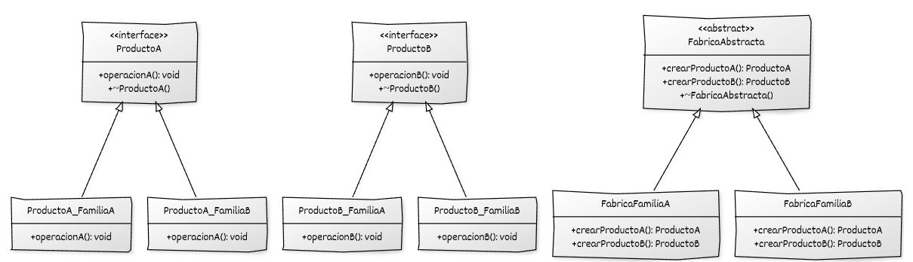

# Implementación de Abstract Factory con C++

## Estructura general

La implementación del **Abstract Factory** se basa en:

* Varias **jerarquías de productos**, una por cada tipo de producto, definidas mediante clases abstractas o interfaces puras
* Una **interfaz de fábrica abstracta** que declara un método de creación por cada producto perteneciente a una **familia de productos**
* Varias **fábricas concretas** que implementan la interfaz de la fábrica abstracta
* Uso de **polimorfismo dinámico** para crear y manipular productos a través de sus interfaces base

## Componentes del patrón y responsabilidades

* **Producto (interfaces base de productos):** definen la interfaz común de cada tipo de producto que puede ser creado por la fábrica abstracta y constituyen los tipos abstractos usados por el cliente.
* **Productos concretos:** implementan las interfaces de los productos y representan las variantes concretas pertenecientes a una misma familia.
* **Fábrica abstracta:** declara los métodos de creación para cada tipo de producto y define la interfaz común que utilizan las fábricas concretas.
* **Fábricas concretas:** implementan los métodos de creación definidos en la fábrica abstracta y construyen los productos concretos de una familia determinada.
* **Código cliente:** utiliza la fábrica abstracta para crear productos y trabaja exclusivamente con las interfaces de los productos obtenidos.

## Diagrama UML



## Ejemplo genérico


```cpp
#include <iostream>
#include <memory>

// ======================================================
//    Interfaces abstractas de los productos
// ======================================================

// Producto 1
class ProductoA {
public:
    virtual ~ProductoA() = default;
    virtual void operacionA() const = 0;
};

// Producto 2
class ProductoB {
public:
    virtual ~ProductoB() = default;
    virtual void operacionB() const = 0;
};


// ======================================================
//    Productos concretos de la Familia A
// ======================================================

class ProductoA_FamiliaA : public ProductoA {
public:
    void operacionA() const override {
        std::cout << "Ejecutando operación A en ProductoA_FamiliaA\n";
    }
};

class ProductoB_FamiliaA : public ProductoB {
public:
    void operacionB() const override {
        std::cout << "Ejecutando operación B en ProductoB_FamiliaA\n";
    }
};


// ======================================================
//    Productos concretos de la Familia B
// ======================================================

class ProductoA_FamiliaB : public ProductoA {
public:
    void operacionA() const override {
        std::cout << "Ejecutando operación A en ProductoA_FamiliaB\n";
    }
};

class ProductoB_FamiliaB : public ProductoB {
public:
    void operacionB() const override {
        std::cout << "Ejecutando operación B en ProductoB_FamiliaB\n";
    }
};


// ======================================================
//    Fábrica abstracta
// ======================================================

class FabricaAbstracta {
public:
    virtual ~FabricaAbstracta() = default;

    virtual std::unique_ptr<ProductoA> crearProductoA() const = 0;
    virtual std::unique_ptr<ProductoB> crearProductoB() const = 0;
};


// ======================================================
//    Fábricas concretas
// ======================================================

class FabricaFamiliaA : public FabricaAbstracta {
public:
    std::unique_ptr<ProductoA> crearProductoA() const override {
        return std::make_unique<ProductoA_FamiliaA>();
    }

    std::unique_ptr<ProductoB> crearProductoB() const override {
        return std::make_unique<ProductoB_FamiliaA>();
    }
};

class FabricaFamiliaB : public FabricaAbstracta {
public:
    std::unique_ptr<ProductoA> crearProductoA() const override {
        return std::make_unique<ProductoA_FamiliaB>();
    }

    std::unique_ptr<ProductoB> crearProductoB() const override {
        return std::make_unique<ProductoB_FamiliaB>();
    }
};


// ======================================================
//    Código cliente
// ======================================================

void cliente(const FabricaAbstracta& fabrica) {
    auto a = fabrica.crearProductoA();
    auto b = fabrica.crearProductoB();

    a->operacionA();
    b->operacionB();
}

int main() {
    FabricaFamiliaA fabricaA;
    FabricaFamiliaB fabricaB;

    cliente(fabricaA);
    cliente(fabricaB);
}
```

## Puntos clave del ejemplo genérico

* La **fábrica abstracta** define los métodos para crear todos los productos de una familia (crearProductoA, crearProductoB)
* Cada **fábrica concreta** produce versiones coherentes de toda su familia:

  * `FabricaFamiliaA`: productos *ProductoA_FamiliaA*, *ProductoB_FamiliaA*
  * `FabricaFamiliaB`: productos *ProductoA_FamiliaB*, *ProductoB_FamiliaB*
* El cliente trabaja solo con **interfaces abstractas** (`ProductoA`, `ProductoB`, `FabricaAbstracta`)
* `std::unique_ptr` garantiza seguridad, propiedad clara y ausencia de fugas
* Añadir una **nueva familia** solo requiere escribir otra fábrica concreta y sus productos
* Evita mezclar productos incompatibles (por ejemplo, ProductoA de FamiliaA con ProductoB de FamiliaB)

