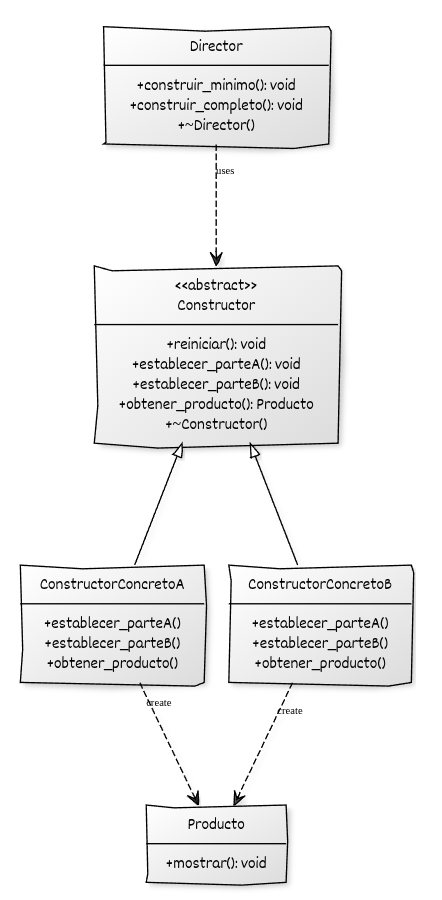
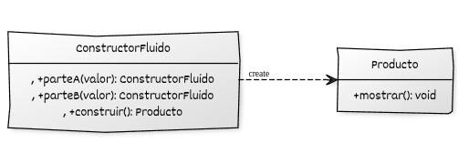

# Implementación del patrón Builder con C++ moderno

## Estructura general

La implementación del **Builder** se basa en:

* Un **Producto** cuya construcción se realiza mediante varios pasos.
* Una **interfaz Builder** que declara los pasos de construcción del producto.
* Uno o varios **Builders concretos** que implementan la interfaz del builder.

Opcionalmente, podemos tener un componente **Director** que se encarga de controlar la secuencia de construcción:

* El **Director** es una **clase concreta** que, por **composición**, mantiene como atributo un objeto del tipo **Builder** (habitualmente a través de una referencia o puntero a la interfaz) y ejecuta una secuencia de construcción invocando los métodos del builder en un orden predefinido.
* Si no se utiliza **Director**, el control de la secuencia recae en el código cliente. En esta variante, el builder concreto suele adoptar un **constructor fluido**, es decir, una interfaz en la que los métodos de configuración devuelven el propio builder (o una referencia a él) para permitir llamadas encadenadas. De este modo, el cliente invoca los pasos de construcción en el orden deseado y finaliza el proceso mediante una operación explícita que devuelve el **Producto** construido.

## Componentes del patrón y responsabilidades

* **Producto:** representa el objeto que se construye y constituye el resultado final del proceso de construcción.
* **Builder (interfaz o clase base):** declara los pasos de construcción del producto y la operación mediante la cual se obtiene el resultado construido.
* **Builders concretos:** implementan los pasos de construcción definidos por el builder y mantienen el estado necesario para ensamblar una variante concreta del producto.
* **Director (opcional):** mantiene un builder por composición y ejecuta una secuencia de pasos de construcción invocando sus métodos.
* **Código cliente:** selecciona el builder y controla la construcción del producto, bien delegando la secuencia en un director o invocando directamente los pasos del builder.


## Diagrama UML (con Director)



## Diagrama UML (sin Director)



## Ejemplo genérico

### Variante 1: Builder con Director (versión clásica)

```cpp
#include <iostream>
#include <memory>

// =====================================================
//                 Producto
// =====================================================

class Producto {
public:
    void establecer_parteA(const std::string& valor) { parteA_ = valor; }
    void establecer_parteB(const std::string& valor) { parteB_ = valor; }

    void mostrar() const {
        std::cout << "Producto: A=" << parteA_
                  << ", B=" << parteB_ << "\n";
    }

private:
    std::string parteA_;
    std::string parteB_;
};

// =====================================================
//                 Builder abstracto
// =====================================================

class Constructor {
public:
    virtual ~Constructor() = default;

    virtual void reiniciar() = 0;
    virtual void establecer_parteA() = 0;
    virtual void establecer_parteB() = 0;
    virtual std::unique_ptr<Producto> obtener_producto() = 0;
};

// =====================================================
//                 Builder concreto
// =====================================================

class ConstructorConcreto : public Constructor {
public:
    ConstructorConcreto() { reiniciar(); }

    void reiniciar() override {
        producto_ = std::make_unique<Producto>();
    }

    void establecer_parteA() override {
        producto_->establecer_parteA("Valor A estándar");
    }

    void establecer_parteB() override {
        producto_->establecer_parteB("Valor B estándar");
    }

    std::unique_ptr<Producto> obtener_producto() override {
        return std::move(producto_);
    }

private:
    std::unique_ptr<Producto> producto_;
};

// =====================================================
//                     Director
// =====================================================

class Director {
public:
    explicit Director(Constructor& ctor) : ctor_(ctor) {}

    std::unique_ptr<Producto> construir_minimo() {
        ctor_.reiniciar();
        ctor_.establecer_parteA();
        return ctor_.obtener_producto();
    }

    std::unique_ptr<Producto> construir_completo() {
        ctor_.reiniciar();
        ctor_.establecer_parteA();
        ctor_.establecer_parteB();
        return ctor_.obtener_producto();
    }

private:
    Constructor& ctor_;
};

// =====================================================
//                     Cliente
// =====================================================

int main() {
    ConstructorConcreto ctor;
    Director director(ctor);

    auto p1 = director.construir_minimo();
    p1->mostrar();

    auto p2 = director.construir_completo();
    p2->mostrar();
}
```

### Variante 2: Builder sin Director (builder fluido moderno)

```cpp
#include <iostream>
#include <memory>
#include <string>

// =====================================================
//                 Producto
// =====================================================

class Producto {
public:
    Producto(const std::string& a, const std::string& b)
        : parteA_(a), parteB_(b) {}

    void mostrar() const {
        std::cout << "Producto: A=" << parteA_
                  << ", B=" << parteB_ << "\n";
    }

private:
    std::string parteA_;
    std::string parteB_;
};

// =====================================================
//                 Builder concreto (fluido)
// =====================================================

class ConstructorFluido {
public:
    ConstructorFluido& parteA(const std::string& valor) {
        parteA_ = valor;
        return *this;
    }

    ConstructorFluido& parteB(const std::string& valor) {
        parteB_ = valor;
        return *this;
    }

    std::unique_ptr<Producto> construir() const {
        return std::make_unique<Producto>(parteA_, parteB_);
    }

private:
    std::string parteA_ = "A por defecto";
    std::string parteB_ = "B por defecto";
};

// =====================================================
//                     Cliente
// =====================================================

int main() {
    auto p = ConstructorFluido{}
                .parteA("A personalizada")
                .parteB("B personalizada")
                .construir();

    p->mostrar();
}

```


