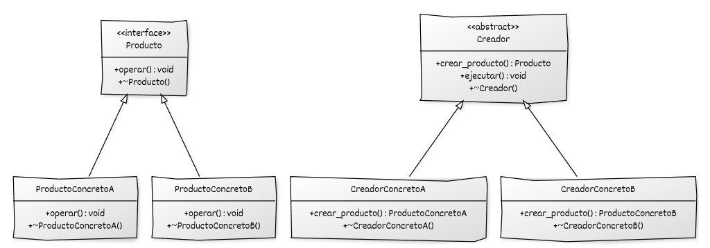

# Implementación de Factory Method con C++

## Estructura general 

La implementación del **Factory Method** se basa en:

* Una **jerarquía de productos**, definida a partir de una clase abstracta o interfaz pura.
* Una **jerarquía de creadores**, definida a partir de una clase abstracta.
* Un **método de creación virtual** declarado en el creador base.
* La **redefinición del método de creación** en los creadores concretos.
* Uso de **polimorfismo dinámico** para crear y manipular productos a través de su tipo abstracto.

## Componentes del patrón y responsabilidades

* **Producto (interfaz o clase base):** define la interfaz común de los objetos que pueden ser creados por el creador y es el tipo abstracto con el que operan el creador y el código cliente.
* **Productos concretos:** implementan la interfaz del producto y proporcionan el comportamiento específico de cada variante instanciable.
* **Creador (interfaz o clase base):** declara el método de creación que devuelve un producto abstracto y contiene la lógica que utiliza el producto sin conocer su tipo concreto.
* **Creadores concretos:** redefinen el método de creación y construyen una instancia de un producto concreto.
* **Código cliente:** utiliza el creador a través de su interfaz y trabaja con los productos obtenidos mediante el método de creación.

## Diagrama UML



## Ejemplo genérico


```cpp
#include <iostream>
#include <memory>

// ----------------------------------------
// Interfaz base del producto
// ----------------------------------------
class Producto {
public:
    virtual ~Producto() = default;
    virtual void operar() const = 0;
};

// Producto concreto A
class ProductoConcretoA : public Producto {
public:
    void operar() const override {
        std::cout << "Operación del ProductoConcretoA\n";
    }
};

// Producto concreto B
class ProductoConcretoB : public Producto {
public:
    void operar() const override {
        std::cout << "Operación del ProductoConcretoB\n";
    }
};

// ----------------------------------------
// Interfaz base del creador
// ----------------------------------------
class Creador {
public:
    virtual ~Creador() = default;

    // Factory Method
    virtual std::unique_ptr<Producto> crear_producto() const = 0;
};

// Creador concreto A
class CreadorConcretoA : public Creador {
public:
    std::unique_ptr<Producto> crear_producto() const override {
        return std::make_unique<ProductoConcretoA>();
    }
};

// Creador concreto B
class CreadorConcretoB : public Creador {
public:
    std::unique_ptr<Producto> crear_producto() const override {
        return std::make_unique<ProductoConcretoB>();
    }
};

// ----------------------------------------
// Código cliente
// ----------------------------------------
void cliente(const Creador& creador) {
    auto producto = creador.crear_producto();  // creación delegada
    producto->operar();                        // uso del producto
}

int main() {
    CreadorConcretoA fabricaA;
    CreadorConcretoB fabricaB;

    cliente(fabricaA);
    cliente(fabricaB);

    return 0;
}

```

## Puntos clave del ejemplo

* El cliente **trabaja con la abstracción `Creador`**, permitiendo sustituir distintos creadores concretos sin modificar el código cliente.
* El método fábrica `crear_producto()` **encapsula la decisión de qué producto concreto se instancia dentro del creador concreto**, no en el cliente.
* El cliente **recibe y utiliza un `Producto` a través de su abstracción**, sin conocer su tipo concreto.
* El polimorfismo se manifiesta tanto en el **creador** como en el **producto**, reforzando la separación entre creación y uso.
* El cliente depende únicamente de **abstracciones**, no de implementaciones concretas.

