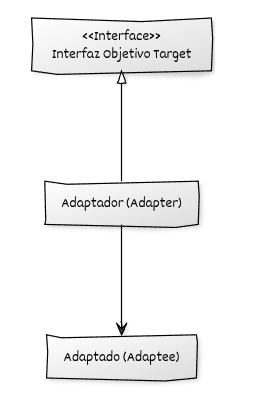

# Implementación de Adapter con C++ moderno

## Estructura y elementos modernos utilizados

La implementación del **patrón Adapter** en C++ moderno se basa en separar claramente la **interfaz objetivo**, el **adaptado** y la **clase adaptadora** que hace de puente entre ambos. Esta estructura permite compatibilizar interfaces incompatibles sin modificar el código original.

### 1. **Interfaz objetivo (Target)**

Representa la interfaz que el cliente espera utilizar. Define las operaciones que el sistema requiere y con las cuales debe trabajar el adaptador.
El cliente interactúa exclusivamente a través de esta interfaz.

**Elementos de C++ moderno utilizados:**

* **Destructores virtuales** para permitir su uso polimórfico mediante punteros inteligentes.
* **Métodos virtuales puros** para definir un contrato claro y estable.
* Uso de referencias o **`std::unique_ptr`** desde el código cliente para garantizar propiedad exclusiva cuando corresponda.

### 2. **Clase adaptada (Adaptee)**

Es una clase ya existente cuya interfaz no coincide con la que el cliente necesita.
Puede ser código legado, externo o simplemente incompatible con el diseño actual.

**Elementos de C++ moderno utilizados:**

* No se modifica la clase adaptada, en cumplimiento del principio *Open/Closed*.
* Su interfaz se usa tal cual, habitualmente a través de composición.

### 3. **Adaptador (Adapter)**

Es la clase clave del patrón. Implementa la interfaz objetivo y contiene internamente una instancia del adaptado.
Traduce las llamadas del cliente a las llamadas apropiadas del objeto adaptado.

**Elementos de C++ moderno utilizados:**

* **Composición** para almacenar el objeto adaptado.
* **Constructores explícitos** para evitar conversiones indebidas al crear el adaptador.
* **Uso de `std::unique_ptr` o referencias** cuando se desea manejar recursos o dependencias de forma clara.
* **Sobrescritura de métodos** (`override`) para definir la adaptación.

### 4. **Código cliente**

Utiliza únicamente la interfaz objetivo y es completamente independiente del objeto adaptado.
El adaptador permite que cualquier implementación incompatible se utilice sin modificar el cliente.

**Elementos de C++ moderno utilizados:**

* **Programación a interfaces**, reforzada por polimorfismo y punteros inteligentes.
* Instanciación sencilla del adaptador mediante `std::make_unique`.

## Diagrama UML



## Ejemplo genérico

```cpp
#include <iostream>
#include <memory>

// ----------------------------------------
// Interfaz objetivo (Target)
// ----------------------------------------
class InterfazObjetivo {
public:
    virtual ~InterfazObjetivo() = default;
    virtual void operacion() const = 0;
};

// ----------------------------------------
// Clase adaptada (Adaptee) con una interfaz incompatible
// ----------------------------------------
class Adaptado {
public:
    void operacion_especifica() const {
        std::cout << "Ejecutando operacion_especifica del Adaptado.\n";
    }
};

// ----------------------------------------
// Adaptador (Adapter)
// ----------------------------------------
class Adaptador : public InterfazObjetivo {
public:
    explicit Adaptador(std::unique_ptr<Adaptado> adaptado)
        : adaptado_(std::move(adaptado)) {}

    void operacion() const override {
        // Traducción de la llamada
        adaptado_->operacion_especifica();
    }

private:
    std::unique_ptr<Adaptado> adaptado_;
};

// ----------------------------------------
// Código cliente
// ----------------------------------------
void cliente(const InterfazObjetivo& objetivo) {
    objetivo.operacion();
}

int main() {
    auto adaptado = std::make_unique<Adaptado>();
    auto adaptador = std::make_unique<Adaptador>(std::move(adaptado));

    cliente(*adaptador);

    return 0;
}
```

## Puntos clave del ejemplo

* La interfaz objetivo define lo que el cliente espera sin conocer detalles del adaptado.
* El adaptador implementa la interfaz objetivo y encapsula un objeto adaptado mediante composición.
* La llamada del cliente se traduce directamente en una llamada compatible con el adaptado.
* El cliente permanece completamente desacoplado de la implementación real, reforzando la extensibilidad y el principio *Open/Closed*.
* El uso de `std::unique_ptr` garantiza que la propiedad del objeto adaptado quede claramente definida y se gestione de forma automática mediante RAII.
