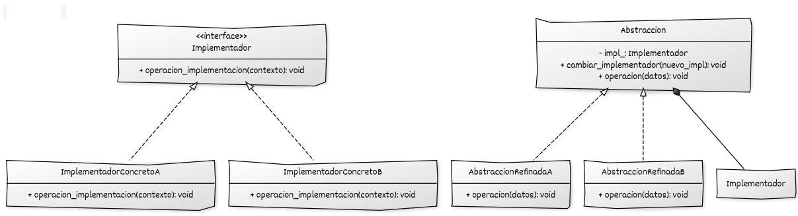

Aquí tienes **la implementación del Patrón Bridge en C++**, siguiendo **exactamente el mismo formato** que usaste para Factory Method.

# Implementación de Bridge con C++

## Estructura y elementos modernos utilizados

La implementación del **Bridge** en C++ moderno se basa en separar dos jerarquías independientes:

* La **Abstracción**, que representa el comportamiento de alto nivel.
* El **Implementador**, que encapsula los detalles de bajo nivel.

La abstracción mantiene un puntero a un implementador y delega en él las operaciones básicas. Esto permite combinar libremente ambas jerarquías.

### 1. Interfaz base del **Implementador**

Define las operaciones primitivas que las abstracciones podrán utilizar.
Cada implementación concreta representa una forma distinta de realizar estas operaciones.

**Elementos de C++ moderno utilizados:**

* **Destructores virtuales** para permitir polimorfismo seguro.
* **`std::unique_ptr`** para gestionar la propiedad del implementador dentro de la abstracción.
* **Polimorfismo dinámico** para permitir sustitución transparente de implementaciones.

### 2. **Implementadores concretos**

Representan variantes independientes de la implementación técnica.
Por ejemplo, dos formas distintas de dibujar, renderizar, comunicar o procesar.

**Elementos de C++ moderno utilizados:**

* **`override`** para implementar operaciones primitivas con seguridad.
* Diseño orientado a RAII: cada implementación gestiona correctamente sus propios recursos.

### 3. Interfaz o clase base de la **Abstracción**

Define la vista de alto nivel del objeto.
Contiene un `unique_ptr` al implementador y delega en él las tareas de bajo nivel.

**Elementos de C++ moderno utilizados:**

* **Composición mediante `std::unique_ptr`** para separar claramente la propiedad del implementador.
* **Delegación explícita** a través de métodos que llaman a la implementación.
* Métodos virtuales que permiten extender la abstracción sin modificar implementaciones existentes.

### 4. **Abstracciones refinadas**

Extienden el comportamiento de alto nivel sin modificar las implementaciones.

**Elementos de C++ moderno utilizados:**

* **Herencia pública** para relación “es-un-tipo‐de-abstracción”.
* Posibilidad de **combinar cualquier abstracción refinada con cualquier implementador** gracias al desacoplamiento.

### 5. **Código cliente**

Trabaja únicamente con la abstracción.
No conoce ni el tipo concreto de la abstracción ni el tipo concreto de la implementación.

**Elementos de C++ moderno utilizados:**

* Programación **a interfaces y a composición**, no a implementaciones concretas.
* Flexibilidad para intercambiar implementadores en tiempo de ejecución.
* Transmisión segura de punteros mediante `std::unique_ptr`.

## Diagrama UML



## Ejemplo genérico

En este ejemplo:

* `Implementador` define la **interfaz de bajo nivel**.
* `ImplementadorConcretoA` y `ImplementadorConcretoB` son dos implementaciones distintas.
* `Abstraccion` define la **vista de alto nivel** y mantiene un `std::unique_ptr<Implementador>`.
* `AbstraccionRefinadaA` y `AbstraccionRefinadaB` añaden variaciones de comportamiento de alto nivel.
* El cliente combina libremente cualquier abstracción refinada con cualquier implementador concreto.

```cpp
#include <iostream>
#include <memory>
#include <string>

// ----------------------------------------
// Interfaz del Implementador
// ----------------------------------------
class Implementador {
public:
    virtual ~Implementador() = default;

    // Operación de bajo nivel que la abstracción utilizará
    virtual void operacion_implementacion(const std::string& contexto) const = 0;
};

// Implementador concreto A
class ImplementadorConcretoA : public Implementador {
public:
    void operacion_implementacion(const std::string& contexto) const override {
        std::cout << "[Implementador A] Procesando contexto: " << contexto << "\n";
    }
};

// Implementador concreto B
class ImplementadorConcretoB : public Implementador {
public:
    void operacion_implementacion(const std::string& contexto) const override {
        std::cout << "[Implementador B] Manejo alternativo de: " << contexto << "\n";
    }
};

// ----------------------------------------
// Abstracción
// ----------------------------------------
class Abstraccion {
protected:
    std::unique_ptr<Implementador> impl_;  // Bridge

public:
    explicit Abstraccion(std::unique_ptr<Implementador> impl)
        : impl_(std::move(impl)) {}

    virtual ~Abstraccion() = default;

    // Permite cambiar la implementación en tiempo de ejecución, si se desea
    void cambiar_implementador(std::unique_ptr<Implementador> nuevo_impl) {
        impl_ = std::move(nuevo_impl);
    }

    // Operación de alto nivel
    virtual void operacion(const std::string& datos) const = 0;
};

// Abstracción refinada A
class AbstraccionRefinadaA : public Abstraccion {
public:
    using Abstraccion::Abstraccion; // hereda el constructor

    void operacion(const std::string& datos) const override {
        std::cout << "[Abstracción A] Preparando datos...\n";
        std::string contexto = "A:" + datos;
        impl_->operacion_implementacion(contexto);
    }
};

// Abstracción refinada B
class AbstraccionRefinadaB : public Abstraccion {
public:
    using Abstraccion::Abstraccion; // hereda el constructor

    void operacion(const std::string& datos) const override {
        std::cout << "[Abstracción B] Validando y transformando datos...\n";
        std::string contexto = "B<" + datos + ">";
        impl_->operacion_implementacion(contexto);
    }
};

// ----------------------------------------
// Código cliente
// ----------------------------------------
int main() {
    // Abstracción A con Implementador A
    AbstraccionRefinadaA objetoA{
        std::make_unique<ImplementadorConcretoA>()
    };
    objetoA.operacion("petición 1");

    // Abstracción B con Implementador B
    AbstraccionRefinadaB objetoB{
        std::make_unique<ImplementadorConcretoB>()
    };
    objetoB.operacion("petición 2");

    // Cambiar implementación en tiempo de ejecución
    objetoB.cambiar_implementador(std::make_unique<ImplementadorConcretoA>());
    objetoB.operacion("petición 3 (reconfigurada)");

    return 0;
}
```

## Puntos claves del ejemplo

* `Implementador` y `Abstraccion` son **jerarquías independientes**.
* Las abstracciones refinadas (`AbstraccionRefinadaA/B`) no necesitan saber qué implementación concreta se usa.
* Los implementadores concretos (`ImplementadorConcretoA/B`) no saben qué tipo de abstracción los utiliza.
* El cliente puede **combinar libremente** cualquier abstracción refinada con cualquier implementador concreto.
* El método `cambiar_implementador` muestra cómo se puede **reconfigurar el puente en tiempo de ejecución**.


