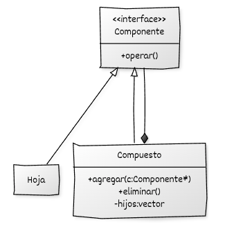

# Implementación de Composite en C++

## Estructura general

La implementación del **Composite** se basa en:

* Una **jerarquía de Componentes** que define los distintos componentes del sistema. Tenemos componentes que no contienen otros componentes (**Hojas**) y componentes **compuestos**.
* Uso de **polimorfismo dinámico** para manipular hojas y compuestos mediante el tipo base Componente.

## Componentes del patrón y responsabilidades

* **Componente (interfaz o clase base):** declara las operaciones comunes que deben soportar todos los elementos de la jerarquía.
* **Hoja:** implementa las operaciones del componente base y representa un elemento sin hijos.
* **Compuesto:** implementa las operaciones del componente base y mantiene una colección de componentes hijos gestionados a través de la interfaz común.
* **Código cliente:** utiliza objetos a través de la interfaz del componente y construye o recorre la estructura jerárquica.

## Diagrama UML




## Ejemplo genérico

```cpp
#include <iostream>
#include <memory>
#include <vector>

// ----------------------------------------
// Interfaz base del componente
// ----------------------------------------
class Componente {
public:
    virtual ~Componente() = default;
    virtual void operar() const = 0;
};

// ----------------------------------------
// Componente hoja
// ----------------------------------------
class Hoja : public Componente {
private:
    std::string nombre_;

public:
    explicit Hoja(std::string nombre)
        : nombre_(std::move(nombre)) {}

    void operar() const override {
        std::cout << "Hoja: " << nombre_ << "\n";
    }
};

// ----------------------------------------
// Componente compuesto
// ----------------------------------------
class Compuesto : public Componente {
private:
    std::string nombre_;
    std::vector<std::unique_ptr<Componente>> hijos_;

public:
    explicit Compuesto(std::string nombre)
        : nombre_(std::move(nombre)) {}

    void agregar(std::unique_ptr<Componente> componente) {
        hijos_.push_back(std::move(componente));
    }

    void operar() const override {
        std::cout << "Compuesto: " << nombre_ << "\n";
        for (const auto& hijo : hijos_) {
            hijo->operar();  // llamada recursiva
        }
    }
};

// ----------------------------------------
// Función cliente
// ----------------------------------------
void cliente(const Componente& componente) {
    componente.operar();
}

// ----------------------------------------
// Ejecución demostrativa
// ----------------------------------------
int main() {
    auto raiz = std::make_unique<Compuesto>("Raíz");

    raiz->agregar(std::make_unique<Hoja>("Hoja A"));
    raiz->agregar(std::make_unique<Hoja>("Hoja B"));

    auto subarbol = std::make_unique<Compuesto>("Subárbol 1");
    subarbol->agregar(std::make_unique<Hoja>("Hoja 1.1"));
    subarbol->agregar(std::make_unique<Hoja>("Hoja 1.2"));

    raiz->agregar(std::move(subarbol));

    cliente(*raiz);

    return 0;
}
```

## Puntos clave del ejemplo

* **Uniformidad:** El cliente desconoce qué elementos son hojas o compuestos, gracias a la interfaz común.
* **Recursividad natural:** Los compuestos delegan operaciones a sus hijos sin lógica adicional.
* **Seguridad en la gestión de memoria:** El uso de `std::unique_ptr` garantiza propiedad y destrucción automática de toda la jerarquía.
* **Extensibilidad:** Se pueden añadir nuevos tipos de componentes sin modificar el código cliente ni la estructura general.
* **Estructura clara:** La distinción entre hojas y compuestos permite modelar estructuras de tipo árbol de forma directa.

