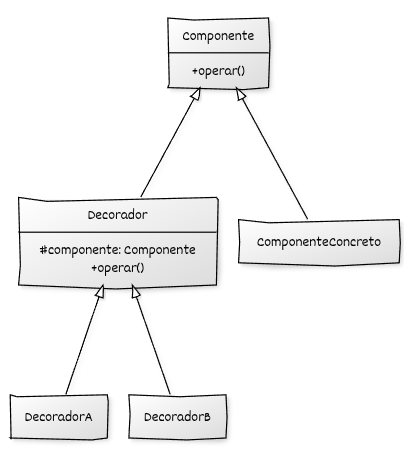

# Implementación de Decorator con C++

## Estructura general

La implementación del **Decorator** en C++ moderno permite **añadir comportamiento a un objeto de forma dinámica** sin modificar su clase original. El patrón se basa en envolver un objeto dentro de otro que implementa la misma interfaz, formando una cadena de objetos que extienden el comportamiento original.

## Elementos de C++ moderno utilizados

* **Clases abstractas e interfaces puras** para definir el componente común.
* **Métodos virtuales y virtuales puros** para permitir extensión polimórfica.
* **Polimorfismo dinámico** para sustituir componentes por decoradores de forma transparente.
* **Destructores virtuales** para destrucción segura de jerarquías polimórficas.
* **Composición** como mecanismo central del patrón.
* **`std::unique_ptr`** para expresar propiedad exclusiva de los componentes envueltos.
* **RAII** para garantizar liberación automática de recursos.
* Uso de **constructores `explicit`** para evitar conversiones implícitas.
* Uso explícito de **`override`** en los decoradores concretos.
* **Composición dinámica de decoradores mediante transferencia de propiedad (`std::move`)**.

## Componentes del patrón y responsabilidades

### 1. Interfaz o clase base del **Componente**

* Define las operaciones comunes que pueden ejecutar componentes y decoradores.
* Establece un contrato único para toda la jerarquía.
* Permite que el cliente interactúe sin conocer si el objeto está decorado.
* Se utiliza de forma polimórfica mediante punteros o referencias.

### 2. **Componente concreto**

* Implementa la funcionalidad principal del sistema.
* Representa el objeto base que puede ser decorado.
* Encapsula un comportamiento simple y bien definido.
* No conoce la existencia de decoradores.

### 3. Clase base **Decorador**

* Implementa la misma interfaz que el componente.
* Contiene internamente otro componente al que delega las llamadas.
* Sirve como base común para todos los decoradores concretos.
* Permite añadir comportamiento antes o después de la delegación.

### 4. **Decoradores concretos**

* Extienden el comportamiento del componente de forma específica.
* Añaden responsabilidades adicionales de manera independiente.
* Pueden combinarse libremente formando cadenas de decoradores.
* Mantienen el contrato definido por la interfaz del componente.

### 5. **Código cliente**

* Trabaja exclusivamente con la interfaz del componente.
* No distingue entre componentes simples y decorados.
* Construye dinámicamente combinaciones de decoradores.
* Gestiona el ciclo de vida de los objetos de forma automática mediante RAII.


## Diagrama UML



## Ejemplo genérico

```cpp
#include <iostream>
#include <memory>

// ----------------------------------------
// Interfaz base del componente
// ----------------------------------------
class Componente {
public:
    virtual ~Componente() = default;
    virtual void operar() const = 0;
};

// ----------------------------------------
// Componente concreto
// ----------------------------------------
class ComponenteConcreto : public Componente {
public:
    void operar() const override {
        std::cout << "Operación del componente base.\n";
    }
};

// ----------------------------------------
// Clase base del decorador
// ----------------------------------------
class Decorador : public Componente {
protected:
    std::unique_ptr<Componente> componente_;

public:
    explicit Decorador(std::unique_ptr<Componente> componente)
        : componente_(std::move(componente)) {}

    void operar() const override {
        // Delegación al componente envuelto
        componente_->operar();
    }
};

// ----------------------------------------
// Decorador concreto A
// ----------------------------------------
class DecoradorA : public Decorador {
public:
    explicit DecoradorA(std::unique_ptr<Componente> componente)
        : Decorador(std::move(componente)) {}

    void operar() const override {
        std::cout << "[DecoradorA] Antes de operar.\n";
        Decorador::operar();
        std::cout << "[DecoradorA] Después de operar.\n";
    }
};

// ----------------------------------------
// Decorador concreto B
// ----------------------------------------
class DecoradorB : public Decorador {
public:
    explicit DecoradorB(std::unique_ptr<Componente> componente)
        : Decorador(std::move(componente)) {}

    void operar() const override {
        std::cout << "[DecoradorB] <<Extendiendo comportamiento>>\n";
        Decorador::operar();
    }
};

// ----------------------------------------
// Código cliente
// ----------------------------------------
int main() {
    // Componente base
    std::unique_ptr<Componente> componente =
        std::make_unique<ComponenteConcreto>();

    // Decoramos progresivamente
    componente = std::make_unique<DecoradorA>(std::move(componente));
    componente = std::make_unique<DecoradorB>(std::move(componente));

    // Uso final: el cliente no sabe que hay decoradores
    componente->operar();

    return 0;
}
```

## Puntos clave del ejemplo

* El decorador **no altera** el comportamiento del componente base: solo lo **extiende**.
* Las responsabilidades adicionales pueden **encadenarse** dinámicamente.
* `std::unique_ptr` garantiza una **gestión segura y automática del ciclo de vida** de toda la cadena.
* No se requiere modificar ninguna clase existente para añadir un nuevo comportamiento: basta con crear un nuevo decorador.
* El cliente siempre trabaja con la **interfaz común**, cumpliendo el principio *Programar a una interfaz, no a una implementación*.
* La llamada a `Decorador::operar()` invoca explícitamente la **implementación de la clase base del decorador**, permitiendo delegar la operación al componente envuelto y extender su comportamiento sin recursión ni duplicación de código.
