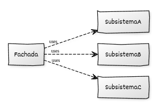

# Implementación de Facade con C++

## Estructura general

La implementación del **Facade** en C++ moderno permite **simplificar el acceso a un sistema complejo** proporcionando una interfaz única y de alto nivel. El patrón encapsula la interacción entre varios subsistemas y expone al cliente únicamente las operaciones necesarias para su uso habitual.

Este enfoque reduce el acoplamiento, mejora la legibilidad del código cliente y protege al sistema frente a cambios internos, manteniendo una interfaz estable y controlada.

## Elementos de C++ moderno utilizados

* **Constructores y listas de inicialización** para crear los subsistemas en estados válidos desde la construcción.
* **RAII** para gestionar automáticamente los recursos asociados a los subsistemas.
* **Composición** para agrupar subsistemas dentro de la fachada.
* **Objetos con duración automática** como miembros de la clase fachada.
* **Encapsulación** para ocultar la complejidad interna del sistema.

## Componentes del patrón y responsabilidades

### 1. **Subsistemas internos**

* Representan componentes que realizan tareas específicas del sistema.
* Mantienen responsabilidades claras y bien delimitadas.
* No están diseñados para ser utilizados directamente por el cliente.
* Pueden evolucionar internamente sin afectar a la fachada.

### 2. **Clase Fachada**

* Proporciona una interfaz simple y de alto nivel al cliente.
* Coordina la interacción entre los distintos subsistemas.
* Encapsula secuencias complejas de operaciones en métodos claros.
* Aísla al cliente de cambios en la estructura interna del sistema.

### 3. **Código cliente**

* Trabaja exclusivamente con la clase fachada.
* No conoce ni gestiona los subsistemas internos.
* Utiliza el sistema de forma más legible y directa.
* Permanece estable ante modificaciones internas del sistema.

## Diagrama UML



## Ejemplo genérico

```cpp
#include <iostream>
#include <string>

// ----------------------------------------
// Subsistemas internos
// ----------------------------------------

class SubsistemaA {
public:
    void inicializar() const {
        std::cout << "[A] Inicializando recursos...\n";
    }
    void procesar() const {
        std::cout << "[A] Procesando datos.\n";
    }
};

class SubsistemaB {
public:
    void cargar_configuracion() const {
        std::cout << "[B] Cargando configuración.\n";
    }
    void validar() const {
        std::cout << "[B] Validando parámetros.\n";
    }
};

class SubsistemaC {
public:
    void ejecutar_tarea() const {
        std::cout << "[C] Ejecutando tarea principal.\n";
    }
    void limpiar() const {
        std::cout << "[C] Limpiando recursos.\n";
    }
};

// ----------------------------------------
// Clase Fachada
// ----------------------------------------

class FachadaSistema {
private:
    SubsistemaA a_;
    SubsistemaB b_;
    SubsistemaC c_;

public:
    FachadaSistema() = default;

    // Operación de alto nivel
    void operacion_principal() const {
        std::cout << "=== Iniciando operación principal ===\n";
        a_.inicializar();
        b_.cargar_configuracion();
        b_.validar();
        a_.procesar();
        c_.ejecutar_tarea();
        c_.limpiar();
        std::cout << "=== Operación completada ===\n";
    }

    // Otra operación simplificada
    void operacion_rapida() const {
        std::cout << "=== Operación rápida ===\n";
        a_.procesar();
        c_.ejecutar_tarea();
    }
};

// ----------------------------------------
// Código cliente
// ----------------------------------------

int main() {
    FachadaSistema sistema;

    sistema.operacion_principal();
    std::cout << "\n";
    sistema.operacion_rapida();

    return 0;
}
```

## Puntos clave del ejemplo

* La clase `FachadaSistema` encapsula completamente la interacción entre múltiples subsistemas (`SubsistemaA`, `SubsistemaB`, `SubsistemaC`).
* Los subsistemas **no exponen detalles innecesarios** al cliente: solo la fachada coordina su uso.
* La interfaz de la fachada ofrece métodos de **alto nivel**, fáciles de entender y usar.
* Si los subsistemas cambian internamente, el cliente no necesita ser modificado mientras la fachada mantenga su API.
* El patrón mejora la **modularidad**, disminuye el acoplamiento y aumenta la legibilidad de las operaciones complejas.
