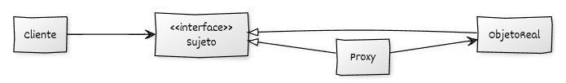

# Implementación de Proxy con C++

## Estructura y elementos modernos utilizados

La implementación del **Proxy** en C++ moderno se basa en tres elementos principales: una **interfaz común**, un **objeto real** y un **proxy** que controla el acceso al objeto real y delega en él cuando corresponde.
A continuación se describe la estructura general y los mecanismos modernos de C++ utilizados.

### 1. Interfaz común (**Sujeto**)

Define las operaciones que tanto el objeto real como el proxy deben implementar.
El cliente trabaja únicamente con esta interfaz.

**Elementos de C++ moderno utilizados:**

* **Clases abstractas** con métodos virtuales puros.
* **Destructores virtuales** para permitir polimorfismo seguro.
* Uso de **`std::unique_ptr`** para gestionar la propiedad del objeto real dentro del proxy.

### 2. **Objeto Real**

Implementa la funcionalidad completa. Suele ser costoso o estar sometido a restricciones de acceso.

**Elementos de C++ moderno utilizados:**

* Inicialización segura de recursos mediante RAII.
* Implementación clara y directa del comportamiento real.
* Posible uso de retardos o simulaciones para ilustrar comportamiento costoso.

### 3. **Proxy**

El proxy implementa la misma interfaz que el sujeto, pero añade lógica adicional antes o después de delegar al objeto real.

**Elementos de C++ moderno utilizados:**

* **Inicialización diferida del objeto real** (`lazy initialization`) mediante `std::unique_ptr`.
* **Comprobaciones previas** (control de acceso, logs, métricas, etc.).
* Encapsulación adicional de comportamiento sin modificar el objeto real.
* Separación entre responsabilidad del cliente y manejo interno del recurso.

### 4. **Código cliente**

Interactúa únicamente con el proxy, sin conocer si la operación se ejecuta directamente o pasa por el objeto real.

**Elementos de C++ moderno utilizados:**

* **Programación a interfaces**, nunca a clases concretas.
* Punteros inteligentes para una gestión limpia y robusta del ciclo de vida.
* Independencia completa respecto a la implementación del objeto real.

## Diagrama UML



## Ejemplo genérico

```cpp
#include <iostream>
#include <memory>
#include <string>

// ----------------------------------------
// Interfaz común (Sujeto)
// ----------------------------------------
class ISujeto {
public:
    virtual ~ISujeto() = default;
    virtual void realizar_operacion(const std::string& usuario) = 0;
};

// ----------------------------------------
// Objeto Real
// ----------------------------------------
class ObjetoReal : public ISujeto {
public:
    void realizar_operacion(const std::string& usuario) override {
        std::cout << "ObjetoReal: ejecutando operación para '" 
                  << usuario << "'.\n";
    }
};

// ----------------------------------------
// Proxy
// ----------------------------------------
class Proxy : public ISujeto {
private:
    std::unique_ptr<ObjetoReal> objeto_real_;

    bool comprobar_acceso(const std::string& usuario) const {
        std::cout << "Proxy: comprobando acceso para '" 
                  << usuario << "'...\n";
        return usuario == "admin";
    }

    void registrar_acceso(const std::string& usuario) const {
        std::cout << "Proxy: registrando uso del servicio por '" 
                  << usuario << "'.\n";
    }

public:
    void realizar_operacion(const std::string& usuario) override {
        if (!objeto_real_) {
            std::cout << "Proxy: inicializando ObjetoReal bajo demanda...\n";
            objeto_real_ = std::make_unique<ObjetoReal>();
        }

        if (comprobar_acceso(usuario)) {
            registrar_acceso(usuario);
            objeto_real_->realizar_operacion(usuario);
        } else {
            std::cout << "Proxy: acceso denegado a '" 
                      << usuario << "'.\n";
        }
    }
};

// ----------------------------------------
// Código cliente
// ----------------------------------------
void cliente(ISujeto& servicio, const std::string& usuario) {
    std::cout << "Cliente: intentando usar el servicio como '" 
              << usuario << "'.\n";
    servicio.realizar_operacion(usuario);
    std::cout << "----------------------------------------\n";
}

// ----------------------------------------
// main
// ----------------------------------------
int main() {
    Proxy servicio_proxy;

    cliente(servicio_proxy, "invitado");
    cliente(servicio_proxy, "admin");

    return 0;
}
```

## Puntos clave del ejemplo

* **El cliente nunca conoce el ObjetoReal**: solo usa `ISujeto`.
* El **proxy controla el acceso**, registra las actividades y crea el objeto real solo cuando es necesario.
* El uso de **`std::unique_ptr`** garantiza una gestión de recursos clara y segura.
* El patrón permite añadir capacidades extra (logs, permisos, caché…) sin modificar la clase del objeto real.
* La inicialización diferida ilustra el uso típico del **Virtual Proxy**.

