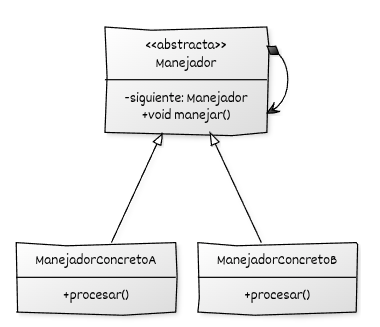

# Implementación de Chain of Responsibility con C++

## Estructura general

La implementación del **Chain of Responsibility** se basa en:

* Una **jerarquía de Manejadores** que declara e implementa la operación de manejo de una petición.

## Componentes del patrón y responsabilidades

* **Manejador (interfaz o clase base):** declara la operación de manejo y define el enlace hacia el siguiente manejador por composición. Los manejadores se **enlazan secuencialmente**, formando una **lista enlazada simple** de objetos del tipo Manejador.
* **Manejadores concretos:** implementan la operación de manejo y deciden si procesan la petición o la delegan al siguiente manejador.
* **Código cliente:** envía la petición al primer manejador a través de la interfaz del manejador.


## Diagrama UML



## Ejemplo genérico

```cpp
#include <iostream>
#include <memory>
#include <string>

// ----------------------------------------
// Interfaz base del manejador
// ----------------------------------------
class Manejador {
public:
    virtual ~Manejador() = default;

    void establecer_siguiente(std::unique_ptr<Manejador> siguiente) {
        siguiente_ = std::move(siguiente);
    }

    void manejar(const std::string& peticion) const {
        if (!procesar(peticion) && siguiente_) {
            siguiente_->manejar(peticion);
        }
    }

protected:
    virtual bool procesar(const std::string& peticion) const = 0;

private:
    std::unique_ptr<Manejador> siguiente_;
};

// ----------------------------------------
// Manejador concreto A
// ----------------------------------------
class ManejadorConcretoA : public Manejador {
protected:
    bool procesar(const std::string& peticion) const override {
        if (peticion == "A") {
            std::cout << "ManejadorConcretoA procesó la petición.\n";
            return true;
        }
        return false;
    }
};

// Manejador concreto B
class ManejadorConcretoB : public Manejador {
protected:
    bool procesar(const std::string& peticion) const override {
        if (peticion == "B") {
            std::cout << "ManejadorConcretoB procesó la petición.\n";
            return true;
        }
        return false;
    }
};

// ----------------------------------------
// Código cliente
// ----------------------------------------
void cliente(const Manejador& manejador) {
    for (const auto& valor : {"A", "B", "C"}) {
        std::cout << "Enviando petición: " << valor << "\n";
        manejador.manejar(valor);
    }
}

int main() {
    // Construcción de la cadena
    auto manejadorA = std::make_unique<ManejadorConcretoA>();
    auto manejadorB = std::make_unique<ManejadorConcretoB>();

    // Encadenamiento: A -> B
    manejadorA->establecer_siguiente(std::move(manejadorB));

    // Uso del cliente
    cliente(*manejadorA);

    return 0;
}
```
## Puntos clave del ejemplo

* Los manejadores devuelven `bool` en su método `procesar` para indicar si la petición fue atendida.
* El uso de `std::unique_ptr` evita fugas y define claramente la propiedad de cada segmento de la cadena.
* El cliente desconoce cuántos manejadores forman la cadena o cuál procesará cada petición.
* Es sencillo insertar nuevos manejadores sin modificar código existente, cumpliendo *Open/Closed*.
* La separación entre *procesamiento* y *delegación* permite cadenas flexibles y configurables en tiempo de ejecución.

