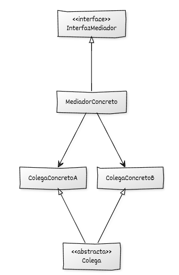

# Implementación de Mediator con C++

## Estructura general

La implementación del **Mediator** se basa en:

* Una **interfaz o clase base Mediador** que declara las operaciones de coordinación.
* Uno o varios **Mediadores concretos** que implementan la lógica de interacción.
* Una **interfaz o clase base Colega** que representa a los objetos participantes.
* Uno o varios **Colegas concretos** que implementan el comportamiento específico.
* Cada **Colega mantiene una referencia al Mediador** (por composición) y no mantiene referencias a otros colegas.
* El **Mediador mantiene referencias a los Colegas** que coordina, normalmente almacenadas en una colección.
* Uso de **polimorfismo dinámico** para interactuar a través de las interfaces base.

---

## Componentes del patrón y responsabilidades

* **Mediador (interfaz o clase base):** declara las operaciones mediante las cuales se coordina la comunicación entre los colegas.
* **Mediador concreto:** implementa las reglas de interacción y coordina las acciones entre los colegas registrados.
* **Colega (interfaz o clase base):** define la interfaz común de los objetos participantes y mantiene una referencia al mediador.
* **Colegas concretos:** implementan el comportamiento específico y notifican al mediador cuando se produce un evento relevante.
* **Código cliente:** crea el mediador y los colegas, establece las relaciones entre ellos y pone en marcha el sistema.

## Diagrama UML



## Ejemplo genérico en C++

```cpp
#include <iostream>
#include <memory>
#include <string>

// ------------------------------------------------------
// Interfaz del Mediador
// ------------------------------------------------------
class InterfazMediador {
public:
    virtual ~InterfazMediador() = default;

    virtual void notificar(const std::string& emisor,
                           const std::string& evento) = 0;
};

// ------------------------------------------------------
// Clase base Colega
// ------------------------------------------------------
class Colega {
public:
    virtual ~Colega() = default;

    void establecer_mediador(std::weak_ptr<InterfazMediador> mediador) {
        mediador_ = mediador;
    }

protected:
    void notificar_mediador(const std::string& evento) {
        if (auto m = mediador_.lock()) {
            m->notificar(nombre(), evento);
        }
    }

    virtual std::string nombre() const = 0;

private:
    std::weak_ptr<InterfazMediador> mediador_;
};

// ------------------------------------------------------
// Colega concreto A
// ------------------------------------------------------
class ColegaConcretoA : public Colega {
public:
    void accionA() {
        std::cout << "A realiza accionA().\n";
        notificar_mediador("accionA");
    }

    void reaccionar() {
        std::cout << "A reacciona a orden del mediador.\n";
    }

private:
    std::string nombre() const override {
        return "ColegaA";
    }
};

// ------------------------------------------------------
// Colega concreto B
// ------------------------------------------------------
class ColegaConcretoB : public Colega {
public:
    void accionB() {
        std::cout << "B realiza accionB().\n";
        notificar_mediador("accionB");
    }

    void reaccionar() {
        std::cout << "B reacciona a orden del mediador.\n";
    }

private:
    std::string nombre() const override {
        return "ColegaB";
    }
};

// ------------------------------------------------------
// Mediador concreto
// ------------------------------------------------------
class MediadorConcreto : public InterfazMediador {
public:
    void registrar_colegaA(std::shared_ptr<ColegaConcretoA> a) {
        colegaA_ = std::move(a);
    }

    void registrar_colegaB(std::shared_ptr<ColegaConcretoB> b) {
        colegaB_ = std::move(b);
    }

    void notificar(const std::string& emisor,
                   const std::string& evento) override
    {
        std::cout << "[Mediador] Evento '" << evento
                  << "' recibido de " << emisor << ".\n";

        if (emisor == "ColegaA" && evento == "accionA") {
            if (colegaB_) {
                std::cout << "[Mediador] -> Indicando a B que reaccione.\n";
                colegaB_->reaccionar();
            }
        }
        else if (emisor == "ColegaB" && evento == "accionB") {
            if (colegaA_) {
                std::cout << "[Mediador] -> Indicando a A que reaccione.\n";
                colegaA_->reaccionar();
            }
        }
    }

private:
    std::shared_ptr<ColegaConcretoA> colegaA_;
    std::shared_ptr<ColegaConcretoB> colegaB_;
};

// ------------------------------------------------------
// Código cliente
// ------------------------------------------------------
int main() {
    auto mediador = std::make_shared<MediadorConcreto>();

    auto colegaA = std::make_shared<ColegaConcretoA>();
    auto colegaB = std::make_shared<ColegaConcretoB>();

    colegaA->establecer_mediador(mediador);
    colegaB->establecer_mediador(mediador);

    mediador->registrar_colegaA(colegaA);
    mediador->registrar_colegaB(colegaB);

    // Interacciones
    colegaA->accionA();
    std::cout << "\n";
    colegaB->accionB();

    return 0;
}

```
## Puntos clave del ejemplo

* Los colegas **no se comunican directamente** entre ellos, sino a través del mediador.
* Se usan **`std::shared_ptr`** y **`std::weak_ptr`** para evitar ciclos de referencia y gestionar fácilmente el ciclo de vida.
* El mediador contiene **todas las reglas de coordinación**, lo que simplifica mucho el comportamiento de los colegas.
* El cliente solo **registra vínculos** y ejecuta operaciones, sin involucrarse en la lógica de interacción.
* Cambiar las reglas del sistema solo requiere **modificar o sustituir el mediador**, sin tocar los colegas.
