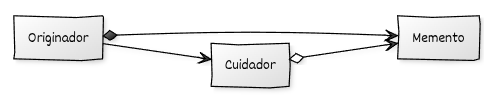

# Implementación de Memento con C++

## Estructura y elementos modernos utilizados

La implementación del **Memento** en C++ moderno se organiza en torno a tres roles fundamentales: **Originador**, **Memento** y **Cuidador (Caretaker)**. Cada uno tiene responsabilidades claras que preservan el encapsulamiento del estado y permiten restaurarlo de forma segura.

### 1. **Originador**

Es el objeto cuyo estado queremos poder guardar y restaurar. Es el único que puede crear y consumir objetos *memento*.

**Elementos de C++ moderno utilizados:**

* **Encapsulación estricta** mediante atributos privados.
* Uso de **`std::string`**, `int`, u otros tipos modernos para representar estado.
* Devolución de mementos mediante **`std::unique_ptr`** para una propiedad clara del estado guardado.
* Métodos `crear_memento()` y `restaurar_desde(const Memento&)` para gestionar el proceso.

### 2. **Memento**

Almacena internamente el estado del originador. Mantiene sus detalles ocultos para cualquier otro elemento del sistema excepto el originador.

**Elementos de C++ moderno utilizados:**

* Clases internas o independientes con **constructores privados o restringidos**.
* Estructura inmutable: no expone setters ni detalles internos.
* Uso de `friend` para que solo el originador pueda acceder al contenido interno.

### 3. **Cuidador (Caretaker)**

Administra los mementos, típicamente almacenando un historial. No tiene acceso al estado interno del memento, solo los conserva y los entrega cuando se necesiten.

**Elementos de C++ moderno utilizados:**

* Colecciones modernas como **`std::vector<std::unique_ptr<Memento>>`**.
* Gestión automática de memoria mediante RAII.
* Interfaz mínima para añadir y recuperar mementos.

### 4. **Código cliente**

Interacciona con el cuidador y el originador sin conocer los detalles internos del estado.

**Elementos de C++ moderno utilizados:**

* Uso natural de punteros inteligentes y objetos temporales.
* Encapsulación reforzada: el cliente nunca ve el estado que se guarda.


## Diagrama UML



## Ejemplo genérico

```cpp
#include <iostream>
#include <memory>
#include <string>
#include <vector>

// ------------------------------------------------------------
// Clase Memento
// ------------------------------------------------------------
class Memento {
private:
    std::string estado_;

    // Solo el Originador puede construir mementos
    friend class Originador;

    explicit Memento(std::string estado)
        : estado_(std::move(estado)) {}

public:
    // No se exponen getters públicos para mantener encapsulación
};

// ------------------------------------------------------------
// Clase Originador (crea y restaura mementos)
// ------------------------------------------------------------
class Originador {
private:
    std::string estado_;

public:
    explicit Originador(std::string estado_inicial)
        : estado_(std::move(estado_inicial)) {}

    void establecer_estado(std::string nuevo_estado) {
        estado_ = std::move(nuevo_estado);
    }

    void mostrar_estado() const {
        std::cout << "Estado actual: " << estado_ << "\n";
    }

    // Crear un memento con el estado actual
    std::unique_ptr<Memento> crear_memento() const {
        return std::make_unique<Memento>(estado_);
    }

    // Restaurar el estado desde un memento
    void restaurar_desde(const Memento& m) {
        estado_ = m.estado_;
    }
};

// ------------------------------------------------------------
// Clase Cuidador (gestiona los mementos)
// ------------------------------------------------------------
class Cuidador {
private:
    std::vector<std::unique_ptr<Memento>> historial_;

public:
    void guardar(std::unique_ptr<Memento> m) {
        historial_.push_back(std::move(m));
    }

    const Memento* obtener(std::size_t indice) const {
        if (indice < historial_.size())
            return historial_[indice].get();
        return nullptr;
    }
};

// ------------------------------------------------------------
// Código cliente
// ------------------------------------------------------------
int main() {
    Originador originador{"Estado inicial"};
    Cuidador cuidador;

    originador.mostrar_estado();

    // Guardamos un memento
    cuidador.guardar(originador.crear_memento());

    // Cambiamos estado
    originador.establecer_estado("Estado modificado");
    originador.mostrar_estado();

    // Restauramos estado previo
    if (const Memento* m = cuidador.obtener(0)) {
        originador.restaurar_desde(*m);
    }

    originador.mostrar_estado();

    return 0;
}
```


## Puntos clave del ejemplo

* El **Originador** es el único que accede al contenido del memento gracias a `friend`, preservando el encapsulamiento.
* El **Memento** no expone su estado: solo guarda los datos y permite que el originador los restaure.
* El **Cuidador** almacena mementos sin conocer su estructura interna, cumpliendo el principio de responsabilidad única.
* El uso de **`std::unique_ptr`** garantiza que cada memento tenga un propietario claro y evita fugas de memoria.
* La implementación soporta un historial completo de estados con un mecanismo simple y seguro.

