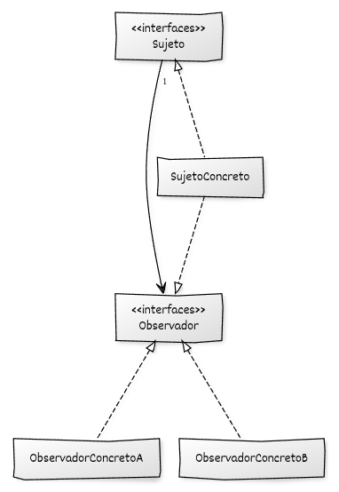

# Implementación de Observer con C++

## Estructura general

La implementación del **Observer** se basa en:

* Una **interfaz Observador** que declara la operación de notificación.
* Una **interfaz Sujeto (Observable)** que declara las operaciones de suscripción, desuscripción y notificación.
* Uno o varios **Observadores concretos** que implementan la interfaz de observador.
* Uno o varios **Sujetos concretos** que implementan la interfaz de sujeto.
* El **Sujeto mantiene una colección de Observadores** almacenados y gestionados a través de la interfaz `Observador`.
* Uso de **polimorfismo dinámico** para notificar observadores a través de la interfaz base.

## Componentes del patrón y responsabilidades

* **Observador (interfaz):** declara la operación que invoca el sujeto para notificar un cambio.
* **Sujeto / Observable (interfaz):** declara las operaciones para registrar y eliminar observadores, y la operación de notificación.
* **Sujeto concreto:** mantiene el estado observado y ejecuta la notificación a los observadores registrados cuando corresponde.
* **Observadores concretos:** implementan la operación de notificación y ejecutan su reacción cuando reciben una actualización.
* **Código cliente:** crea sujetos y observadores, y establece las suscripciones entre ellos.

## Diagrama UML



## Ejemplo genérico

```cpp
#include <iostream>
#include <memory>
#include <vector>
#include <string>
#include <algorithm>

// ----------------------------------------
// Interfaz base del observador
// ----------------------------------------
class Observador {
public:
    virtual ~Observador() = default;
    virtual void actualizar(int nuevo_valor) = 0;
};

// ----------------------------------------
// Interfaz base del sujeto (observable)
// ----------------------------------------
class Sujeto {
public:
    virtual ~Sujeto() = default;

    virtual void adjuntar(const std::shared_ptr<Observador>& observador) = 0;
    virtual void desadjuntar(const std::shared_ptr<Observador>& observador) = 0;

protected:
    virtual void notificar(int nuevo_valor) = 0;
};

// ----------------------------------------
// Sujeto concreto
// ----------------------------------------
class SujetoConcreto : public Sujeto {
public:
    void establecer_valor(int valor) {
        if (valor_ != valor) {
            valor_ = valor;
            notificar(valor_);
        }
    }

    int obtener_valor() const {
        return valor_;
    }

    void adjuntar(const std::shared_ptr<Observador>& observador) override {
        observadores_.push_back(observador);
    }

    void desadjuntar(const std::shared_ptr<Observador>& observador) override {
        // Eliminamos el observador indicado y limpiamos los expirados
        observadores_.erase(
            std::remove_if(
                observadores_.begin(),
                observadores_.end(),
                [&observador](const std::weak_ptr<Observador>& debil) {
                    auto fuerte = debil.lock();
                    return !fuerte || fuerte == observador;
                }),
            observadores_.end()
        );
    }

protected:
    void notificar(int nuevo_valor) override {
        // Recorremos los observadores; si alguno ha expirado, lo limpiamos más tarde
        observadores_.erase(
            std::remove_if(
                observadores_.begin(),
                observadores_.end(),
                [nuevo_valor](std::weak_ptr<Observador>& debil) {
                    auto fuerte = debil.lock();
                    if (!fuerte) {
                        // Observador ya no existe: se elimina
                        return true;
                    }
                    fuerte->actualizar(nuevo_valor);
                    return false;
                }),
            observadores_.end()
        );
    }

private:
    int valor_{0};
    std::vector<std::weak_ptr<Observador>> observadores_;
};

// ----------------------------------------
// Observadores concretos
// ----------------------------------------
class ObservadorConcretoA : public Observador {
public:
    explicit ObservadorConcretoA(std::string nombre)
        : nombre_{std::move(nombre)} {}

    void actualizar(int nuevo_valor) override {
        std::cout << "[ObservadorConcretoA - " << nombre_
                  << "] Nuevo valor recibido: " << nuevo_valor << '\n';
    }

private:
    std::string nombre_;
};

class ObservadorConcretoB : public Observador {
public:
    explicit ObservadorConcretoB(std::string nombre)
        : nombre_{std::move(nombre)} {}

    void actualizar(int nuevo_valor) override {
        std::cout << "[ObservadorConcretoB - " << nombre_
                  << "] Procesando cambio de valor: " << nuevo_valor << '\n';
    }

private:
    std::string nombre_;
};

// ----------------------------------------
// Función cliente
// ----------------------------------------
void ejemplo_cliente() {
    auto sujeto = std::make_shared<SujetoConcreto>();

    auto observador1 = std::make_shared<ObservadorConcretoA>("A1");
    auto observador2 = std::make_shared<ObservadorConcretoB>("B1");

    sujeto->adjuntar(observador1);
    sujeto->adjuntar(observador2);

    std::cout << "Estableciendo valor = 10\n";
    sujeto->establecer_valor(10);

    std::cout << "Desadjuntando observador A1\n";
    sujeto->desadjuntar(observador1);

    std::cout << "Estableciendo valor = 20\n";
    sujeto->establecer_valor(20);
}

int main() {
    ejemplo_cliente();
    return 0;
}
```

## Puntos clave del ejemplo

* El **sujeto** (`SujetoConcreto`) mantiene una lista de observadores usando `std::weak_ptr`, evitando ciclos de referencia con los `std::shared_ptr` que se usan en el código cliente.
* La interfaz `Observador` define un método `actualizar(int nuevo_valor)` que representa la notificación de cambio; cada observador concreto decide cómo reaccionar.
* La interfaz `Sujeto` separa claramente la **gestión de suscriptores** (`adjuntar`, `desadjuntar`) de la **notificación** (`notificar`), reforzando el principio de responsabilidad única.
* El código cliente programa contra **interfaces** y usa `std::make_shared` para crear instancias, aprovechando RAII y evitando la gestión manual de memoria.
* Añadir un nuevo tipo de observador (por ejemplo, `ObservadorConcretoC`) solo requiere implementar la interfaz `Observador` y registrar instancias en el sujeto, sin modificar el código del sujeto ni del resto de observadores.
