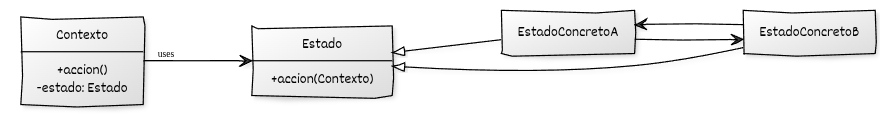

# Implementación de State con C++

## Estructura general

La implementación del **State** en C++ moderno permite **modelar comportamientos variables como objetos independientes**, encapsulando cada estado en una clase distinta. El objeto principal, denominado *contexto*, delega su comportamiento en el estado activo y cambia dinámicamente dicho estado cuando es necesario.

Este enfoque elimina grandes estructuras condicionales, localiza el comportamiento dependiente del estado y facilita la extensión del sistema mediante la incorporación de nuevos estados.

## Elementos de C++ moderno utilizados

* **Clases abstractas e interfaces puras** para definir el contrato común de los estados.
* **Métodos virtuales y virtuales puros** para permitir comportamiento polimórfico.
* **Polimorfismo dinámico** para delegar la ejecución al estado activo.
* **Destructores virtuales** para destrucción segura mediante punteros a la interfaz.
* **`std::unique_ptr`** para expresar propiedad exclusiva del estado por parte del contexto.
* **RAII** para garantizar la gestión automática del ciclo de vida de los estados.
* Uso de **`std::make_unique`** para crear estados de forma segura.
* **Movimiento de objetos (`std::move`)** para realizar transiciones entre estados.

## Componentes del patrón y responsabilidades

### 1. Interfaz o clase base del **Estado**

* Define las operaciones cuyo comportamiento depende del estado.
* Establece un contrato común para todos los estados concretos.
* Permite al contexto delegar sin conocer el estado activo concreto.
* Se utiliza de forma polimórfica mediante punteros inteligentes.

### 2. **Estados concretos**

* Implementan el comportamiento específico de cada estado.
* Deciden cómo responder a cada operación.
* Pueden provocar transiciones a otros estados.
* Encapsulan completamente la lógica asociada a su estado.

### 3. **Contexto**

* Mantiene una referencia al estado actual.
* Delegan en el estado activo las operaciones dependientes del estado.
* Controla el ciclo de vida del estado mediante propiedad exclusiva.
* Permanece desacoplado de las implementaciones concretas de los estados.

### 4. **Código cliente**

* Interactúa únicamente con el contexto.
* No conoce los estados concretos ni las transiciones internas.
* Utiliza el comportamiento del contexto de forma transparente.
* Permanece estable ante la incorporación de nuevos estados.

## Diagrama UML



## Ejemplo genérico

```cpp
#include <iostream>
#include <memory>

// ----------------------------------------
// Declaraciones anticipadas
// ----------------------------------------
class Estado;

// ----------------------------------------
// Contexto (solo declaración de métodos)
// ----------------------------------------
class Contexto {
public:
    explicit Contexto(std::unique_ptr<Estado> estado_inicial);

    void cambiar_estado(std::unique_ptr<Estado> nuevo_estado);
    void accion();

private:
    std::unique_ptr<Estado> estado;
};

// ----------------------------------------
// Interfaz base del estado
// ----------------------------------------
class Estado {
public:
    virtual ~Estado() = default;
    virtual void accion(Contexto& contexto) = 0;
};

// ----------------------------------------
// Declaraciones anticipadas de estados
// ----------------------------------------
class EstadoConcretoA;
class EstadoConcretoB;

// ----------------------------------------
// Estado concreto A
// ----------------------------------------
class EstadoConcretoA : public Estado {
public:
    void accion(Contexto& contexto) override;
};

// ----------------------------------------
// Estado concreto B
// ----------------------------------------
class EstadoConcretoB : public Estado {
public:
    void accion(Contexto& contexto) override;
};

// ----------------------------------------
// Implementación de Contexto
// ----------------------------------------
Contexto::Contexto(std::unique_ptr<Estado> estado_inicial)
    : estado(std::move(estado_inicial)) {}

void Contexto::cambiar_estado(std::unique_ptr<Estado> nuevo_estado) {
    estado = std::move(nuevo_estado);
}

void Contexto::accion() {
    estado->accion(*this);
}

// ----------------------------------------
// Implementaciones de estados
// ----------------------------------------
void EstadoConcretoA::accion(Contexto& contexto) {
    std::cout << "Estado A: ejecutando acción...\n";
    std::cout << "Transición de A → B.\n";
    contexto.cambiar_estado(std::make_unique<EstadoConcretoB>());
}

void EstadoConcretoB::accion(Contexto& contexto) {
    std::cout << "Estado B: ejecutando acción...\n";
    std::cout << "Transición de B → A.\n";
    contexto.cambiar_estado(std::make_unique<EstadoConcretoA>());
}

// ----------------------------------------
// Cliente
// ----------------------------------------
int main() {
    Contexto contexto(std::make_unique<EstadoConcretoA>());

    contexto.accion(); // A → B
    contexto.accion(); // B → A
    contexto.accion(); // A → B
}

```

## Puntos clave del ejemplo

* Se utiliza una declaración anticipada de `Estado` porque `Contexto` necesita almacenar un `std::unique_ptr<Estado>` antes de que la clase `Estado` esté completamente definida, evitando así una dependencia circular entre ambas clases.
* El estado actual se almacena como `std::unique_ptr<Estado>`, lo que encapsula completamente su ciclo de vida.
* Cada estado define su comportamiento particular y las posibles transiciones.
* El contexto desconoce los detalles internos de cada estado y solo delega operaciones.
* Las clases de estado manejan explícitamente las transiciones, eliminando condicionales externos.
* El diseño es totalmente extensible: basta con añadir nuevas clases de estado sin modificar el código existente, cumpliendo el principio *Open/Closed*.


