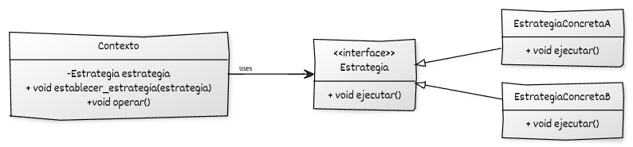

# Implementación de Strategy con C++

## Estructura y elementos modernos utilizados

La implementación del **Strategy** en C++ moderno se organiza en torno a tres componentes principales: la interfaz de estrategia, las estrategias concretas y el contexto. Cada pieza desempeña un papel claro en la definición y selección del algoritmo.

### 1. Interfaz base de la **Estrategia**

Define la operación que representa el algoritmo intercambiable. El contexto utiliza esta interfaz sin saber qué estrategia concreta está asociada.

**Elementos de C++ moderno utilizados:**

* **Destructores virtuales** para asegurar destrucción adecuada vía punteros inteligentes.
* **Polimorfismo dinámico** para permitir que múltiples algoritmos compartan una interfaz común.
* **Métodos `const`** cuando el algoritmo no modifica su estado interno.

### 2. **Estrategias concretas**

Representan diferentes implementaciones del algoritmo. Cada estrategia encapsula la variante correspondiente y está desacoplada del contexto.

**Elementos de C++ moderno utilizados:**

* **Clases ligeras y cohesivas**, centradas exclusivamente en el algoritmo.
* Construcción clara mediante inicializadores o estado interno inmutable.
* Uso de **`override`** para reforzar seguridad en la herencia.

### 3. **Contexto**

Mantiene una referencia a la estrategia actual y delega en ella la ejecución del algoritmo. Puede cambiar la estrategia en tiempo de ejecución.

**Elementos de C++ moderno utilizados:**

* Uso de **`std::unique_ptr`** para garantizar propiedad exclusiva de la estrategia.
* Posibilidad de **ajustar la estrategia dinámicamente** a través de un método `establecer_estrategia()`.
* Delegación limpia mediante polimorfismo.

### 4. **Código cliente**

Crea el contexto, selecciona la estrategia y ejecuta la operación.

**Elementos de C++ moderno utilizados:**

* **Programación a interfaces**, sin referencias directas a estrategias concretas.
* Uso de `std::make_unique` para construir estrategias de forma segura.
* Flexibilidad para intercambiar algoritmos sin modificar el contexto.


## Diagrama UML



## Ejemplo genérico

```cpp
#include <iostream>
#include <memory>

// ----------------------------------------
// Interfaz base de la estrategia
// ----------------------------------------
class Estrategia {
public:
    virtual ~Estrategia() = default;
    virtual void ejecutar() const = 0;
};

// Estrategia concreta A
class EstrategiaConcretaA : public Estrategia {
public:
    void ejecutar() const override {
        std::cout << "Ejecutando algoritmo de Estrategia A.\n";
    }
};

// Estrategia concreta B
class EstrategiaConcretaB : public Estrategia {
public:
    void ejecutar() const override {
        std::cout << "Ejecutando algoritmo de Estrategia B.\n";
    }
};

// ----------------------------------------
// Contexto que utiliza una estrategia
// ----------------------------------------
class Contexto {
private:
    std::unique_ptr<Estrategia> estrategia_;

public:
    explicit Contexto(std::unique_ptr<Estrategia> estrategia)
        : estrategia_(std::move(estrategia)) {}

    // Permite cambiar la estrategia en tiempo de ejecución
    void establecer_estrategia(std::unique_ptr<Estrategia> nueva_estrategia) {
        estrategia_ = std::move(nueva_estrategia);
    }

    // Operación que delega en la estrategia
    void operar() const {
        estrategia_->ejecutar();
    }
};

// ----------------------------------------
// Función cliente
// ----------------------------------------
int main() {
    // Crear contexto con una estrategia inicial
    Contexto contexto(std::make_unique<EstrategiaConcretaA>());
    contexto.operar();  // usa Estrategia A

    // Cambiar estrategia en tiempo de ejecución
    contexto.establecer_estrategia(std::make_unique<EstrategiaConcretaB>());
    contexto.operar();  // ahora usa Estrategia B

    return 0;
}
```

## Puntos clave del ejemplo

* La interfaz `Estrategia` define el *contrato* que deben cumplir todas las variantes del algoritmo.
* Las clases `EstrategiaConcretaA` y `EstrategiaConcretaB` encapsulan comportamientos intercambiables.
* El `Contexto` **no conoce** los detalles de cada algoritmo; solo invoca `ejecutar()`.
* El uso de `std::unique_ptr` asegura una propiedad clara de las estrategias y permite cambiarlas sin fugas de memoria.
* El cliente puede modificar el comportamiento del contexto **en tiempo de ejecución** sin reconstruir objetos ni usar condicionales.


