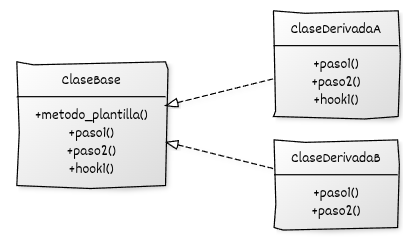

# Implementación de Template Method con C++

## Estructura y elementos modernos utilizados

La implementación del **Template Method** en C++ moderno se compone de una jerarquía donde la clase base define la *plantilla* del algoritmo y las subclases aportan variaciones en pasos concretos. A continuación se describen las piezas fundamentales.

### 1. Clase base con el **método plantilla**

Define el algoritmo completo mediante una secuencia fija de pasos. Algunos pasos son implementados por la clase base, mientras que otros se delegan en las subclases.

**Elementos de C++ moderno utilizados:**

* **Métodos virtuales** (puros, concretos y *hooks*).
* **Control del flujo** desde la clase base (*Hollywood Principle*).
* **`final`** para impedir que el método plantilla sea sobrescrito.
* **RAII** cuando sea necesario en operaciones internas.

### 2. **Métodos abstractos** (pasos obligatorios)

Son pasos que **las subclases deben implementar**. Representan las partes variables del algoritmo.

**Elementos relevantes:**

* `virtual ... = 0` para imponer la implementación.
* Facilitan *polimorfismo dinámico*.

### 3. **Métodos con implementación por defecto**

Son pasos opcionales que las subclases pueden modificar si lo necesitan.

**Elementos relevantes:**

* Métodos virtuales no puros.
* Permiten extender comportamiento sin romper el flujo.

### 4. **Métodos *hook*** (ganchos)

Permiten puntos de extensión opcionales, normalmente con implementaciones vacías o mínimas.

**Elementos relevantes:**

* Ofrecen variación sin obligar a la subclase a implementar nada.

### 5. Subclases concretas

Implementan los pasos necesarios y personalizan partes concretas del algoritmo.

**Elementos utilizados:**

* Sobrescritura clara con `override`.
* Control de comportamiento sin alterar la estructura global.

### 6. Código cliente

Trabaja **solo con la interfaz de la clase base**, invocando el método plantilla sin preocuparse por los detalles concretos del algoritmo.

## Diagrama UML 



## Ejemplo genérico

En este ejemplo se modela un **ProcesoGeneral** cuya estructura es fija pero con pasos que dependen de cada tipo concreto de proceso.

```cpp
#include <iostream>
#include <memory>

// --------------------------------------------------------------
// Clase base con el método plantilla
// --------------------------------------------------------------
class ProcesoGeneral {
public:
    virtual ~ProcesoGeneral() = default;

    // Método plantilla: define la estructura del algoritmo
    void ejecutar() final {
        inicializar();
        paso_principal();
        paso_secundario();
        hook_final();       // Hook opcional
        finalizar();
    }

protected:
    // Pasos obligatorios a implementar por subclases
    virtual void paso_principal() = 0;
    virtual void paso_secundario() = 0;

    // Pasos con implementación fija
    void inicializar() {
        std::cout << "[ProcesoGeneral] Inicializando...\n";
    }

    void finalizar() {
        std::cout << "[ProcesoGeneral] Finalizando.\n";
    }

    // Hook opcional
    virtual void hook_final() {
        // Por defecto no hace nada
    }
};

// --------------------------------------------------------------
// Subclase concreta A
// --------------------------------------------------------------
class ProcesoA : public ProcesoGeneral {
protected:
    void paso_principal() override {
        std::cout << "[ProcesoA] Ejecutando paso principal.\n";
    }

    void paso_secundario() override {
        std::cout << "[ProcesoA] Ejecutando paso secundario.\n";
    }

    void hook_final() override {
        std::cout << "[ProcesoA] Hook final ejecutado.\n";
    }
};

// --------------------------------------------------------------
// Subclase concreta B
// --------------------------------------------------------------
class ProcesoB : public ProcesoGeneral {
protected:
    void paso_principal() override {
        std::cout << "[ProcesoB] Paso principal especializado.\n";
    }

    void paso_secundario() override {
        std::cout << "[ProcesoB] Paso secundario especializado.\n";
    }
    // No sobrescribe hook_final(): usa el comportamiento por defecto
};

// --------------------------------------------------------------
// Función cliente
// --------------------------------------------------------------
void ejecutar_proceso(ProcesoGeneral& proceso) {
    proceso.ejecutar();
}

int main() {
    ProcesoA procesoA;
    ProcesoB procesoB;

    std::cout << "=== Ejecutando ProcesoA ===\n";
    ejecutar_proceso(procesoA);

    std::cout << "\n=== Ejecutando ProcesoB ===\n";
    ejecutar_proceso(procesoB);

    return 0;
}
```

## Puntos clave del ejemplo

* El **método plantilla** (`ejecutar()`) define el orden de ejecución y no puede ser sobrescrito.
* Los métodos **obligatorios** (`paso_principal` y `paso_secundario`) permiten variaciones esenciales.
* El **hook** (`hook_final`) ofrece un punto de extensión opcional.
* El cliente trabaja **solo con la clase base**, siguiendo el principio *“programar a una interfaz”*.
* Las subclases añaden variaciones **sin alterar la estructura global** del algoritmo, reforzando *Open/Closed*.
