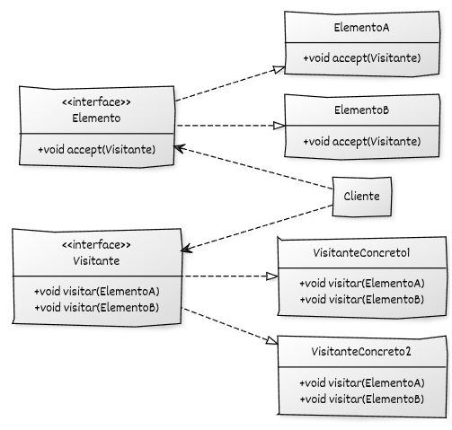

# Implementación de Visitor con C++

## Estructura y elementos modernos utilizados

La implementación del **Visitor** en C++ moderno se organiza alrededor de dos jerarquías fundamentales:
* la jerarquía de **elementos**, que representan objetos de distintos tipos, y
* la jerarquía de **visitantes**, que representan operaciones aplicables a esos objetos.

### 1. Interfaz base de **Elemento**

Define el método `accept(Visitante&)` que habilita el mecanismo de *double dispatch*.
Cada clase concreta implementará este método delegando en el visitante la operación correspondiente.

**Elementos de C++ moderno utilizados:**

* **Destructores virtuales** para permitir el uso polimórfico seguro.
* **Referencias no propietarios** (`Visitante&`) para evitar costes innecesarios de empaquetado.
* Separación estricta entre datos (en los elementos) y comportamiento (en los visitantes).

### 2. **Elementos concretos**

Representan los tipos específicos de la jerarquía sobre los que se aplicarán distintas operaciones.

**Elementos de C++ moderno utilizados:**

* Inicialización clara y segura con RAII.
* Implementación explícita del método `accept`.

### 3. Interfaz base **Visitante**

Contiene un método `visitar()` por cada tipo concreto de elemento.
Esto permite añadir nuevas operaciones creando nuevos visitantes, sin tocar los elementos.

**Elementos de C++ moderno utilizados:**

* Polimorfismo dinámico para habilitar el doble despacho.
* Agrupación de operaciones relacionadas dentro del objeto visitante, mejorando cohesión.

### 4. **Visitantes concretos**

Implementan operaciones específicas sobre cada tipo de elemento: cálculos, impresión, validación, estadísticas, etc.

**Elementos de C++ moderno utilizados:**

* Manejo de lógica compleja concentrada en un único objeto visitante.
* Uso de RAII para almacenar acumuladores o estados internos cuando sea necesario.

### 5. **Código cliente**

Crea elementos y les aplica uno o varios visitantes, sin conocer ni alterar la lógica de los elementos.

**Elementos de C++ moderno utilizados:**

* Contenedores estándar (`std::vector<std::unique_ptr<Elemento>>`) para almacenar estructuras heterogéneas.
* `std::make_unique` para gestionar elementos polimórficos de forma segura.

## Diagrama UML



## Ejemplo genérico en C++

```cpp
#include <iostream>
#include <memory>
#include <vector>

// ----------------------------------------
// Interfaz base del Visitante
// ----------------------------------------
class ElementoA;
class ElementoB;

class Visitante {
public:
    virtual ~Visitante() = default;
    virtual void visitar(ElementoA& elem) = 0;
    virtual void visitar(ElementoB& elem) = 0;
};

// ----------------------------------------
// Interfaz base del Elemento
// ----------------------------------------
class Elemento {
public:
    virtual ~Elemento() = default;
    virtual void accept(Visitante& v) = 0;
};

// ----------------------------------------
// Elementos concretos
// ----------------------------------------
class ElementoA : public Elemento {
public:
    void accept(Visitante& v) override {
        v.visitar(*this); // double dispatch
    }

    void accion_especifica_A() const {
        std::cout << "Acción específica de ElementoA.\n";
    }
};

class ElementoB : public Elemento {
public:
    void accept(Visitante& v) override {
        v.visitar(*this); // double dispatch
    }

    void accion_especifica_B() const {
        std::cout << "Acción específica de ElementoB.\n";
    }
};

// ----------------------------------------
// Visitantes concretos
// ----------------------------------------
class VisitanteConcreto1 : public Visitante {
public:
    void visitar(ElementoA& elem) override {
        std::cout << "VisitanteConcreto1 procesa ElementoA → ";
        elem.accion_especifica_A();
    }

    void visitar(ElementoB& elem) override {
        std::cout << "VisitanteConcreto1 procesa ElementoB → ";
        elem.accion_especifica_B();
    }
};

class VisitanteConcreto2 : public Visitante {
public:
    void visitar(ElementoA& elem) override {
        std::cout << "VisitanteConcreto2 analiza ElementoA.\n";
    }

    void visitar(ElementoB& elem) override {
        std::cout << "VisitanteConcreto2 analiza ElementoB.\n";
    }
};

// ----------------------------------------
// Código cliente
// ----------------------------------------
int main() {
    std::vector<std::unique_ptr<Elemento>> elementos;
    elementos.push_back(std::make_unique<ElementoA>());
    elementos.push_back(std::make_unique<ElementoB>());

    VisitanteConcreto1 v1;
    VisitanteConcreto2 v2;

    std::cout << "--- Aplicando VisitanteConcreto1 ---\n";
    for (auto& e : elementos) {
        e->accept(v1);
    }

    std::cout << "\n--- Aplicando VisitanteConcreto2 ---\n";
    for (auto& e : elementos) {
        e->accept(v2);
    }

    return 0;
}
```

## Puntos clave del ejemplo

* El método `accept` implementa la primera parte del doble despacho llamando al método `visitar` correspondiente.
* Cada `visitar(ElementoX&)` constituye la segunda parte del doble despacho.
* Para añadir una nueva operación, basta con crear un nuevo visitante sin modificar las clases `ElementoA` y `ElementoB`.
* Para añadir un nuevo tipo de elemento, se debe modificar la interfaz del visitante (trade-off del patrón).
* El uso de `std::unique_ptr` y contenedores estándar permite almacenar elementos polimórficos de forma segura.
* La lógica de negocio está completamente separada de la estructura de datos.

Si quieres, puedo añadir una sección final con **qué no hemos modificado**, en el estilo que usas para Factory Method.
