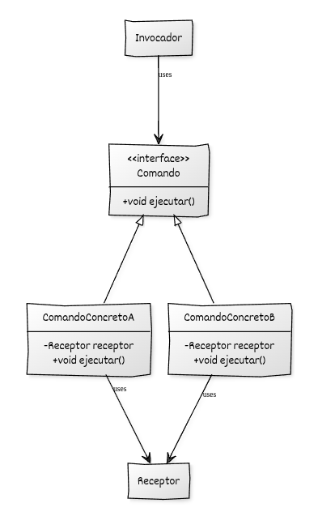

Aquí tienes la **implementación del patrón Command en C++ moderno**, siguiendo **exactamente el mismo formato** que tu ejemplo del Factory Method, con texto formal, nombres en español y un ejemplo lo más genérico posible.


# Implementación de Command en C++

## Estructura y elementos modernos utilizados

La implementación del **Command** en C++ moderno se articula alrededor de una serie de clases con responsabilidades claramente separadas. El objetivo principal es encapsular operaciones como objetos independientes y desacoplar el código que invoca una acción de aquel que la realiza.

### 1. Interfaz base **Comando**

Declara la operación que todos los comandos deben poder ejecutar. El código cliente trabaja únicamente con esta interfaz, sin conocer qué comando concreto se ha asociado.

**Elementos de C++ moderno utilizados:**

* **`std::unique_ptr`** como tipo habitual para gestionar comandos de forma polimórfica.
* **Destructores virtuales** para permitir la destrucción segura de comandos derivados.
* **Polimorfismo dinámico** para tratar todas las operaciones como comandos uniformes.

### 2. **Comandos concretos**

Cada comando implementa la acción específica que se ejecutará. Normalmente colaboran con un **receptor**, que encapsula la lógica de negocio.

**Elementos de C++ moderno utilizados:**

* **Constructores que reciben el receptor por referencia o puntero** para mantener bajo nivel de acoplamiento.
* **`std::unique_ptr`** para instanciación y propiedad clara de comandos compuestos.

### 3. **Receptor**

Es la clase que conoce la lógica real de la operación. Los comandos delegan en él la acción que deben ejecutar.

**Elementos de C++ moderno utilizados:**

* Diseño enfocado en la separación clara entre comando (acción solicitada) y receptor (acción realizada).
* Uso natural de RAII y métodos const-correctos.

### 4. **Invocador**

Es el objeto que almacena y ejecuta comandos. No conoce ni el receptor ni la operación concreta: solo llama a `ejecutar()`.

**Elementos de C++ moderno utilizados:**

* **Asignación dinámica de comandos** usando `std::unique_ptr`.
* **Programación a interfaces** para permitir que el invocador funcione con cualquier comando que se le asigne.

### 5. **Código cliente**

Crea los receptores, los comandos concretos y asigna comandos al invocador. Controla la configuración del sistema sin acoplarse a los detalles internos.


## Diagrama UML



## Ejemplo genérico

```cpp
#include <iostream>
#include <memory>

// ----------------------------------------
// Receptor: contiene la lógica real
// ----------------------------------------
class Receptor {
public:
    void accionA() const {
        std::cout << "Receptor: ejecutando acción A.\n";
    }

    void accionB(int valor) const {
        std::cout << "Receptor: ejecutando acción B con valor = "
                  << valor << ".\n";
    }
};

// ----------------------------------------
// Interfaz base del comando
// ----------------------------------------
class Comando {
public:
    virtual ~Comando() = default;
    virtual void ejecutar() const = 0;
};

// ----------------------------------------
// Comando concreto A
// ----------------------------------------
class ComandoConcretoA : public Comando {
public:
    explicit ComandoConcretoA(Receptor& receptor)
        : receptor_(receptor) {}

    void ejecutar() const override {
        receptor_.accionA();
    }

private:
    Receptor& receptor_;
};

// ----------------------------------------
// Comando concreto B
// ----------------------------------------
class ComandoConcretoB : public Comando {
public:
    ComandoConcretoB(Receptor& receptor, int valor)
        : receptor_(receptor), valor_(valor) {}

    void ejecutar() const override {
        receptor_.accionB(valor_);
    }

private:
    Receptor& receptor_;
    int valor_;
};

// ----------------------------------------
// Invocador
// ----------------------------------------
class Invocador {
public:
    void establecer_comando(std::unique_ptr<Comando> comando) {
        comando_ = std::move(comando);
    }

    void ejecutar_comando() const {
        if (comando_) {
            comando_->ejecutar();
        } else {
            std::cout << "Invocador: no hay comando asignado.\n";
        }
    }

private:
    std::unique_ptr<Comando> comando_;
};

// ----------------------------------------
// Código cliente
// ----------------------------------------
int main() {
    Receptor receptor;

    Invocador invocador;

    invocador.establecer_comando(
        std::make_unique<ComandoConcretoA>(receptor)
    );
    invocador.ejecutar_comando();

    invocador.establecer_comando(
        std::make_unique<ComandoConcretoB>(receptor, 42)
    );
    invocador.ejecutar_comando();

    return 0;
}
```


## Puntos clave del ejemplo

* Cada operación se encapsula dentro de un **objeto comando**, lo que permite parametrizar acciones y tratarlas de forma uniforme.
* El **invocador** desconoce por completo qué operación concreta se ejecuta y quién la realiza.
* El **receptor** contiene la lógica de negocio real y queda aislado del resto del sistema.
* Con `std::unique_ptr` se garantiza una **gestión segura de la memoria** y una propiedad clara de los comandos.
* El diseño facilita extender el sistema con nuevos comandos **sin modificar código existente**, reforzando el principio *Open/Closed*.
