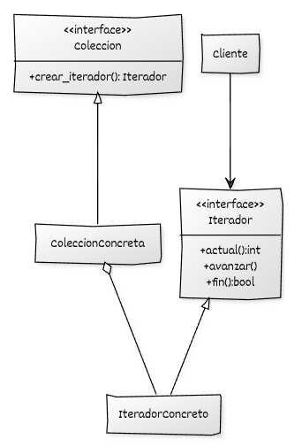

# Implementación de Iterator con C++

## Estructura y elementos modernos utilizados

La implementación del **Iterator** en C++ moderno se organiza en torno a tres elementos básicos: la **colección**, el **iterador** y el **cliente**. A continuación se describen las responsabilidades de cada uno y los mecanismos relevantes en C++ moderno.

### 1. **Interfaz del Iterador**

Define las operaciones necesarias para recorrer una colección de manera uniforme.
Permite acceder al elemento actual, avanzar al siguiente y comprobar si la iteración ha terminado.

**Elementos modernos utilizados:**

* Uso de **punteros inteligentes** cuando el iterador debe gestionar recursos dinámicos (en este ejemplo no es necesario, pero es habitual en colecciones complejas).
* **Polimorfismo dinámico** para permitir distintos iteradores sobre una misma colección.
* Métodos como `actual()`, `avanzar()` y `fin()` que abstraen completamente la estructura interna.

### 2. **Interfaz de la Colección**

Declara un método para crear un iterador.
La colección puede exponer también operaciones propias de gestión, pero el acceso secuencial se delega totalmente al iterador.

**Elementos modernos utilizados:**

* Devolución de `std::unique_ptr<Iterador>` para expresar propiedad clara.
* Separación estricta entre **almacenamiento** (colección) e **iteración** (iterador).

### 3. **Iteradores concretos**

Implementan la lógica de recorrido según la estructura interna de la colección.

**Elementos modernos utilizados:**

* Implementación explícita de un algoritmo de recorrido sin exponer detalles internos.
* Uso de **`std::size_t`** para índices o posiciones.
* Encapsulación completa de los detalles internos de la colección.

### 4. **Colección concreta**

Almacena los elementos y permite crear iteradores adecuados.
En este ejemplo se usa un contenedor basado en `std::vector`, pero la idea se aplica a cualquier estructura (listas, árboles, grafos…).

**Elementos modernos utilizados:**

* Almacenamiento basado en **`std::vector`**.
* Construcción segura de iteradores mediante `std::make_unique`.

### 5. **Código cliente**

Utiliza únicamente la interfaz del iterador, sin conocer la estructura de la colección.
Puede recorrer cualquier colección que provea un iterador compatible.

**Elementos modernos utilizados:**

* Programación a interfaces.
* Recorrido uniforme, independiente de la estructura de datos.

## Diagrama UML



## Ejemplo genérico

```cpp
#include <iostream>
#include <memory>
#include <vector>

// ----------------------------------------
// Interfaz del iterador
// ----------------------------------------
class Iterador {
public:
    virtual ~Iterador() = default;

    virtual int actual() const = 0;
    virtual void avanzar() = 0;
    virtual bool fin() const = 0;
};

// ----------------------------------------
// Interfaz de la colección
// ----------------------------------------
class Coleccion {
public:
    virtual ~Coleccion() = default;
    virtual std::unique_ptr<Iterador> crear_iterador() const = 0;
};

// ----------------------------------------
// Colección concreta basada en vector
// ----------------------------------------
class ColeccionEnteros : public Coleccion {
private:
    std::vector<int> datos;

public:
    ColeccionEnteros(std::initializer_list<int> valores)
        : datos(valores) {}

    std::unique_ptr<Iterador> crear_iterador() const override;

    // Método auxiliar para obtener acceso (no lo usa el cliente directamente)
    const std::vector<int>& obtener_datos() const {
        return datos;
    }
};

// ----------------------------------------
// Iterador concreto para ColeccionEnteros
// ----------------------------------------
class IteradorEnteros : public Iterador {
private:
    const std::vector<int>& ref_datos;
    std::size_t indice = 0;

public:
    explicit IteradorEnteros(const std::vector<int>& datos)
        : ref_datos(datos) {}

    int actual() const override {
        return ref_datos[indice];
    }

    void avanzar() override {
        ++indice;
    }

    bool fin() const override {
        return indice >= ref_datos.size();
    }
};

// Implementación del método fábrica de la colección
std::unique_ptr<Iterador> ColeccionEnteros::crear_iterador() const {
    return std::make_unique<IteradorEnteros>(datos);
}

// ----------------------------------------
// Código cliente
// ----------------------------------------
void recorrer(const Coleccion& coleccion) {
    auto it = coleccion.crear_iterador();

    while (!it->fin()) {
        std::cout << "Elemento: " << it->actual() << "\n";
        it->avanzar();
    }
}

int main() {
    ColeccionEnteros numeros {1, 2, 3, 4, 5};

    recorrer(numeros);

    return 0;
}
```
## Puntos clave del ejemplo

* La colección **no expone** su implementación interna al cliente.
* El cliente usa únicamente la interfaz `Iterador` para recorrer los elementos.
* El iterador concreto encapsula por completo la lógica de recorrido.
* El uso de `std::unique_ptr` garantiza una gestión segura y clara del iterador.
* Es sencillo añadir **nuevos tipos de recorrido** creando otras clases derivadas de `Iterador` sin modificar el código existente (cumpliendo *Open/Closed*).

