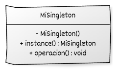

# Implementación de Singleton con C++

## Estructura y elementos modernos utilizados

La implementación del **Singleton** en C++ moderno se organiza en torno a una única clase con responsabilidades muy claras: controlar su propia instancia y ofrecer un punto de acceso global y seguro. A continuación se describen los elementos más relevantes y los mecanismos de C++ moderno implicados.

### 1. Clase **Singleton**

Es la clase que queremos restringir a una única instancia en todo el programa. Es la responsable de:

* Evitar que el código externo cree instancias adicionales.
* Gestionar la creación y el acceso a la instancia única.
* Proporcionar los servicios que consumirá el resto del sistema.

**Elementos de C++ moderno utilizados:**

* **Constructor privado** (y, si procede, destructor privado o protegido) para impedir la creación y destrucción directa de objetos desde fuera.
* **Constructor de copia y operador de asignación eliminados** (`= delete`) para evitar que se dupliquen instancias.
* Opcionalmente, **constructores de movimiento eliminados** para impedir traslados de la instancia.

### 2. Método estático de acceso (`instance()`)

Es la puerta de entrada al Singleton. Devuelve una referencia (o puntero) a la instancia única, creando dicha instancia en la primera invocación si se usa inicialización perezosa, retrasando la creación de un recurso hasta que el código lo solicita explícitamente.

**Elementos de C++ moderno utilizados:**

* **Variable estática local** dentro de la función `instance()`, cuya inicialización es segura en C++11 y posteriores incluso en entornos multihilo.
* Devolución de una **referencia** (por ejemplo, `Singleton&`) para evitar copias y dejar claro que no se transfiere propiedad.

### 3. Inicialización segura y control de ciclo de vida

El patrón debe garantizar que la instancia se inicializa de forma controlada y que su destrucción, si se produce, sea correcta.

**Elementos de C++ moderno utilizados:**

* **Inicialización estática local (Meyers Singleton)**, que asegura:

  * Creación de la instancia en el primer uso (lazy initialization).
  * Inicialización libre de condiciones de carrera en C++11+.
* Destrucción automática de la instancia al final del programa (cuando se utilizan estáticos de función), sin necesidad de código explícito de limpieza.

### 4. Interfaz pública del Singleton

La clase expone un conjunto de métodos (`set_config`, `log`, `get_valor`, etc.) que representan el servicio global que se quiere centralizar.

**Elementos de C++ moderno utilizados:**

* Métodos `const` donde corresponda, respetando la inmutabilidad lógica.
* Uso de tipos modernos de la biblioteca estándar: `std::string`, contenedores (`std::vector`, `std::map`, etc.), `std::optional`, etc.
* Posible uso de **`noexcept`** en operaciones que no lanzan excepciones, para mejorar la robustez y claridad de la interfaz.

### 5. Código cliente

El código cliente nunca crea instancias del Singleton. En su lugar, solicita la instancia única y la utiliza para acceder al servicio centralizado.

**Elementos de C++ moderno utilizados:**

* **Acceso controlado** mediante `Singleton::instance()` en lugar de variables globales dispersas.
* **Reducción de acoplamiento estructural** frente al uso de variables globales simples (aunque el acoplamiento lógico sigue existiendo).
* Mayor facilidad para localizar el punto de acceso global, lo que ayuda a futuras refactorizaciones (por ejemplo, si se decide reemplazar el Singleton por inyección de dependencias).

## Diagrama UML



## Ejemplo genérico

```cpp
#include <iostream>

class MiSingleton {
public:
    // Punto de acceso global a la instancia única
    static MiSingleton& instance() {
        static MiSingleton instancia;  // Inicialización perezosa y segura
        return instancia;
    }

    // Métodos que representan el servicio del singleton
    void operacion() {
        std::cout << "Ejecutando operación del Singleton.\n";
    }

    // Eliminar copia y asignación
    MiSingleton(const MiSingleton&) = delete;
    MiSingleton& operator=(const MiSingleton&) = delete;

    // (Opcional) eliminar movimiento
    MiSingleton(MiSingleton&&) = delete;
    MiSingleton& operator=(MiSingleton&&) = delete;

private:
    // Constructor privado
    MiSingleton() = default;

    // Destructor privado (o protegido) opcional
    ~MiSingleton() = default;

    // Aquí podría existir estado interno,
    // pero este ejemplo no incluye ninguno.
};

// ----------------------------------------
// Código cliente
// ----------------------------------------
int main() {
    auto& s1 = MiSingleton::instance();
    auto& s2 = MiSingleton::instance();

    s1.operacion();

    // Demostración: s1 y s2 son la misma instancia
    std::cout << "¿Es el mismo objeto? "
              << std::boolalpha
              << (&s1 == &s2) << "\n";

    return 0;
}
```

## Puntos clave del ejemplo

* **La clase controla completamente su propia instancia**, gracias al constructor privado y a la eliminación explícita de copia, asignación y movimiento.
* El método estático `instance()` **proporciona un punto de acceso global**, centralizando el uso del recurso sin recurrir a variables globales dispersas.
* La instancia se almacena como una **variable estática local** dentro de `instance()`, lo que garantiza:
  * **Inicialización perezosa** (se crea en la primera llamada).
  * Destrucción automática al finalizar el programa.
* El código cliente **no puede crear objetos adicionales** de `MiSingleton`; solo obtiene referencias a la instancia existente.
* La interfaz pública (`operacion()`) demuestra cómo el Singleton puede ofrecer un servicio centralizado sin exponer detalles internos.
* Todas las responsabilidades relacionadas con la creación, ciclo de vida y unicidad del objeto **quedan encapsuladas en una única clase**, promoviendo claridad estructural.

